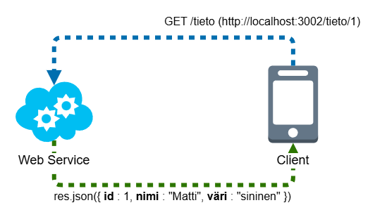

# Demo 2: Web Service -perusteita

Demo 2:ssa perehdytään Web Service -käsitteeseen. Web Service -sovelluksilla tarkoitetaan sovelluksia, jotka lähettävät tietoa jollekin toiselle järjestelmälle, palvelulle tai sovellukselle. Kyseessä ei siis ole ensisijaisesti ihmisen käyttämä sovellus.

Web Service voi esimerkiksi lähettää tietoja asiakassovellukseen (client), jota ihminen käyttää. Tässä asiakassovellus toimii front-endinä sovellus-stackille, jossa Web Service on osa back-endiä, eli taustajärjestelmää.

Kuva 1. Web Service Diagram

Tässä käydään vain demo 2:n kannalta uudet toiminnallisuudet, eli esimerkiksi Express-sovellusten määritystä ei enää tässä kerrota erikseen.

### 1. index.html

Vaikka demo 2 sovellus onki nyt tällainen Web Service -sovellus, joka ei ensisijaisesti palauta selaimelle tietoa, on tähän kuitenkin tehty tällainen selaimessa näytettävä esittelysivu, jossa kerrotaan lyhyesti Web Servicen toiminnasta ja demon reiteistä.

Tästä eteenpäin Sovellusohjelmointi 2 -opintojaksolla ensisijainen testaustyökalu on Postman. Vaikka yksinkertaisia json-palautuksia voidaan kyllä selaimellakin näyttää, on Postman demojen ja tehtävien toteuttamisen ja suorittamisen kannalta tarkoituksenmukaisempi ohjelma. Ottakaa siis se tässä vaiheessa mukaan käyttöön.

### 2. Postmanin käyttö

Postmanilla voidaan tehdä REST-pyyntöjä eri osoitteisiin ja ohjelmisto sisältää selainta paremmat työkalut reittipyyntöjen testaamiselle ja esimerkiksi otsikkotietojen määrittelylle. Reitti voidaan kirjoittaa kuvan 2 mukaisesti. Hakupalkin vasemmalla puolella on dropdown-menu, josta voidaan valita pyynnön tyyli. Haun alla on mm. hakuparametrien määrittely, autorisaation asetukset, otsikkotiedot, bodyn rakenne jne. Näitä käydään opintojakson aikana lisää.

Jokainen REST-pyyntö koostuu hakukentän alla olevista välilehdistä ja niiden tiedoista. Tiedot voivat olla kyllä tyhjiä, mutta tässä on tyypillinen HTTP-pyynnön rakenne, joilla palvelimen pyyntöjä ja vastauksia rakennetaan.

Alla olevassa esimerkissa haetaan demon `index.html`-sivua ja Postman palauttaa sivun lähdekoodin. Lähdekoodia voidaan tarkastella eri näkymillä

- `Pretty`: Syntaksinkorostus html-koodille
- `Raw`: Raakadatan tulostus ilman syntaksin korostuksia tai muotoiluja
- `Preview`: Esikatselu selainnäkymälle

### 3. Käyttäjä-tietomalli (kayttajat.ts)

Demossa havainnollistetaan Web Servicen toimintaa tietokannan tietojen hakemisessa. Nyt oikeaa tietokantaa ei ole määritetty, vaan sen toimintaa ajetaan json-dataan pohjautuvalla TypeScript-tiedostolla (`models/kayttajat.ts`). Tieto on alun perin json-tiedostosta otettu json-data, mutta se on muutettu TypeScript-tiedostoon arrayksi, jota käytetään Kayttaja-rajapinnan kanssa.

Käytännössä aina, kun kehitetään Web Service -sovelluksia, jotka kommunikoivat asiakkaan kanssa, tietoa siirretään erikseen määritetyissä tietomalleissa. Tässäkin demossa "tietokannan" käyttäjätiedoille luodaan oma tietomalli TypeScriptin rajapintoja (interface) hyödyntäen, jonka pohjalta luotuihin ilmentymiin tietoja haetaan ja lähetetään vastauksena REST-pyyntöihin eri reiteissä.

Tietomalli on luotu `models`-kansioon (yleinen nimitys).

Syy, miksi demossa `kayttajat.json` -tiedosto on muunnettu TypeScript-tiedostoksi `kayttajat.ts` liittyy JavaScript-sovellusten toimintaan. Moderni tapa tuoda tietoja muista tiedostoista on käyttää import-komentoa. JSON-data voitaisiin myös lukea hyödyntäen Noden File System -moduulia (`fs`), mutta tällä tietojen tuonti on kieltämättä työläämpää. Kun käyttäjien tiedoista tehdään TypeScriptiä hyödyntäen `Kayttaja`-rajapinta, se voidaan suoraan vain importata Express-sovellukseen `index.ts`.

Tarkemmat tiedot löydät `kayttajatSelitys.md`-tiedostosta.

### 4. Express-sovelluksen reitit

Demosovellus sisältää kolme reittiä erilasten tietojen hakemiseen.

#### `/kayttajatiedot`

Haetaan kaikki käyttäjät, joista muodostetaan Express-sovelluksessa (`index.ts`) määritellyn `Kayttajatieto`-rajapinnan muotoisia tietoja. Käyttäjätietojen mallista saatavat tiedot sisältävät kaikki tiedot, joita käyttäjistä löytyy. Express-sovelluksen REST-pyynnön palauttavat vain osan käyttäjien sisältämistä tiedoista.

Esimerkiksi `/kayttajatiedot` palauttaa tietoina:

- **id**: Käyttäjän id, eli käyttäjä-tietueen yksilöivä käyttäjät-taulukon tunniste
- **nimi**: Muodostuu käyttäjän etunimestä ja sukunimestä
- **sahkoposti**
- **kayttajatunnus**
- **rekisteroitymisPvm**

Huomaa, että reitti ei palauta siis kaikkia mahdollisia tietoja. Myös tietomalli, jota reitti käyttää on uusi `Kayttajatieto`. Tästä lisää `indexSelitys.md`-tiedostossa.

Reitti sisältää vielä ohjausrakenteen, joka tarkastaa, onko GET-pyynnön mukana annettu query-stringinä vuosilukua. Jos vuosiluku on annettu, palautetaan vain ne käyttäjät, jotka ovat rekisteröityneet annettuna vuonna. Näin voidaan edelleen suodattaa hakutuloksia reitin palauttamista arvoista.

Eli kun client-sovellus tekee haun Web Serviceen, eli palvelimelle, voidaan esimerkiksi tehdä suodatettu haku annetuilla rajauksilla. Rajaukset voidaan esimerkiksi antaa query-stringinä, osana GET-pyynnön reittiä (esim. `http://localhost:3002/kayttajatiedot?vuosi=2025`). Rajauksia voidaan käyttää joko tietokanta-haussa tai sitten haun jälkeen tietojen palautuksessa, esimerkiksi ohjausrakennetta hyödyntäen.

#### `/yhteystiedot`

Tässä reitissä haetaan käyttäjistä muodostetut yhteystiedot. Edelleen haetaan kaikki käyttäjät "tietokannasta", mutta käyttäjätietojen sijaan haetaan `Yhteystieto`-rajapinnan mukaiset tiedot.

- **id**
- **nimi**
- **sahkoposti**

#### `/yhteystiedot/:id`

Tässä haussa hyödynnetään `reittiparametria` tietyn käyttäjän hakemiseen. Reittiparametri määritetään osaksi reittiä `:`-merkillä. Tässä on määritetty reittiparametri `id`.

`id` on tyypillinen tieto, jonka mukaan jotain tietokannan tietuetta haetaan. Demossa "tietokannasta" haetaan käyttäjä-tietue, jonka `id` vastaa reittiparametria, joka annetaan URL-osoitteen mukana (esim. `http://localhost:3002/yhteystiedot/1`, tehdään haku id:llä 1).

Reitin vastauksen lohkossa määritellään osana käyttäjän yhteystiedon hakua array-metodit, joilla haku tehdään. `array.map()` käytetään kopioimaan arrayn tiedot (pakollinen toimintamalli JavaScriptissa) ja `array.find()` käytetään etsimään alkio parametrina annetun ehdon perusteella (tässä reittiparametrina saatua id:tä verrataan käyttäjät-taulun tietueisiin ja etsitään vastaavuutta).

### Kayttajatieto- ja Yhteystieto -rajapinnat

Nämä rajapinnat määritellään erikseen tietyn muotoisten käyttäjätietojen hakemiseen ja palauttamiseen reittipyyntöjen vastauksina.

Kuten ylempänä kerrottiin, tarkemmat kuvaukset Express-sovelluksen koodeista ja reiteistä löytyy `indexSelitys.md`-tiedostosta.