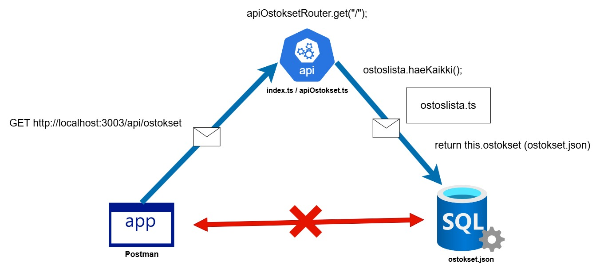

# Demo 3 - REST API

Tämä on demo REST API -palvelinsovelluksesta, jonka tarkoituksena on keskustella muiden sovellusten tai järjestelmien kanssa json-muodossa. REST API on rajapinta, joka mahdollistaa palvelimella/sen taustajärjestelmissä sijaitsevien tietojen lukemisen, lisäämisen, muokkaamisen ja poiston asiakassovelluksella.

Toisin sanottuna REST API on välikäsi, jolla asiakassovellus (eli ihmiskäyttäjä) voi päästä käsiksi kolmansiin palveluihin, jotka sijaitsevat palvelimen/backendin taustalla. Näitä voivat olla tietokannat, muut sovellukset, laitteet jne.

Client-sovellus <---> REST API <---> Kolmas järjestelmä


Kuva: Demo 3 -REST API -palvelinsovelluksen toiminnan graafi. (esimerkkinä kaikkien ostosten haku)


Kuva: Diagrammi REST API:n, eli rajapinnan reiteistä. Reitit ovat tarttumapinta palvelimen taustalla oleviin järjestelmiin.

## Sovelluksen koodit

### index.ts

Palvelinsovelluksen alustus tapahtuu täällä, kuten normaalistikin. `index.ts` toimii aina palvelinsovelluksen "ytimenä" (ainakin sovellusohjelmoinnin toteutuksissa).

Tässä demossa palvelimen ydintoiminnallisuuden lisäksi perehdytään Express Router -ominaisuuden käyttöön apiOstokset -routen avulla.

`apiOstoksetRouter` otetaan käyttöön osana REST API -palvelinsovellusta rivillä 11:

```typescript
app.use("/api/ostokset", apiOstoksetRouter);
```

Tällä komennolla määritetään palvelimen juuren lisäksi oma "route-moduuli" liittyen ostosten käsittelyn kontekstiin. Ostoksien käsittelyyn liittyvät reitit voisi kyllä kirjoittaa suoraan palvelimen "ytimeen" `index.ts`, mutta Express Routeria hyödyntämällä voidaan järjestellä sovelluksen reitityksiä paremmin tarkoituksen mukaan.

Toisin sanoen palvelimelle on luotu oma reitti ostosten käsittelyn rajapintaan, joka sisältää varsinaiset REST-pyyntöjen käsittelijät. Käydään reittejä ja niiden sisältämiä vastauksia tarkemmin osiossa `apiOstokset.ts`

Kun REST-pyyntöjä tehdään ostoksien käsittelylle, haun URL-osoite muodostuu palvelimen ytimestä/juuresta `http://localhost:3003` ja `apiOstokset` -routen määritetystä reitist' `/api/ostokset` + mikä tahansa `apiOstokset` -routen mahdollisesti sisältämä reitti.

Tämän lisäksi ytimessä määritellään staattisten tiedostojen kansio `public`. Tämä on demon kontekstissa luotu lähinnä sovelluksen sisääntulopisteen/entry pointin `index.html` käyttöönottamiseksi. Jos palvelinsovelluksen juureen mennään selaimessa, näytetään `index.html`-sivu, joka sisältää kuvauksen ja ohjeistuksen demon toiminnasta.

## apiOstokset.ts

`apiOstokset.ts` tuo `Ostoslista`-luokan ja `Ostos`-interfacen `ostoslista.ts`-tiedostosta. `ostoslista.ts` ajaa tietokantamallin roolia tässä tilanteessa ja `ostokset.json` on ostoksien tietokantataulu.

`apiOstokset` luo uuden ilmentymän tietokannasta rivillä 4. Tässä  alustetaan sovelluksen käynnistyessä uusi tietokanta"sessio" annetun mallin (`ostoslista.ts`) pohjalta. `ostokset.json` sisältää tallenteen sessioiden välisistä tietojen muutoksista, eli käytännössä tämä on pysyvä tallenne tietokannan ostokset-taulusta. Taulun tietoja voidaan lisätä, muuttaa ja poistaa sessioiden aikana, jolloin taulun sisältämä data muuttuu. Tähän dataan päästään käsiksi käynnistämällä tietokanta"sessio" sovelluksen yhteydessä. `ostoslista.ts` on käytännössä tietokannan käyttöliittymä varsinaisen datan `ostokset.json` käsittelylle.

Rivillä 6 `apiOstokset`-tiedostolle määritellään Express Router, joka luo uuden "ali-rajapinnan" palvelinsovellukseen:

```typescript
const apiOstoksetRouter : express.Router = express.Router();
```

Määrittely tehdään tässä ja se riittää. Nyt tämä Express.Routeriksi määritelty `apiOstoksetRouter`-muuttuja voidaan tuoda `index.ts`-tiedostossa osaksi palvelinta (index.ts, rivi 3), jonka jälkeen tälle routerille voidaan määrittää arvona polku, jolla tätä routeria kutsutaan (index.ts, rivi 11).

Eli käytännössä, kun kutsutaan palvelimen juuren URL-osoitteen yhteydessä `/api/ostokset`, päästään käsiksi `apiOstokset.ts`-tiedostoissa määriteltyihin reitteihin. URL-osoite `http://localhost:3003/api/ostokset/` vastaa nyt `apiOstokset.ts`-tiedoston juuren reittikäsittelijää `apiOstoksetRouter.get("/");`

Koska demo 3:n tietokanta on toteutettu json-tiedostolla, eli `apiOstokset.ts` palauttaa REST-pyyntöjen vastauksena json-dataa, pitää Express-sovellus määrittämään käsittelemään json-muotoista dataa (rivi 8). Rivin 8 määrittely riittää, jotta sovellus osaa automaattisesti käsitellä dataa esim. `res.json`-metodilla, eli mitään ei tarvitse tuoda importilla tai kutsua erikseen määrittelyn jälkeen.

Loput tiedoston koodeista ovatkin sitten varsinaisia ostokset-rajapinnan reittejä, joilla voidaan käsitellä taustalla toimivaa tietokantaa. Reittejä on:

- Kaikkien tietojen hakemiselle `get("/");`
- Yhden tiedon hakemiselle `get("/:id");`
- Tiedon lisäämiselle `post("/");`
- Yhden tiedon päivittämiselle/muuttamiselle `put("/:id");`
- Yhden tiedon poistamiselle `delete(/:id);`

Huomaa, että yhtä tietoa käsitellessä pitää luonnollisesti lähettää jokin tieto, jolla tieto voidaan yksilöidä kaikista ostoksista. Tätä varten tietokannoissa määritellään jokaiselle tietueelle/alkiolle oma uniikki id, eli tunniste, jolla tietueeseen viitataan. Tässä esimerkissä käytetään kokonaislukuja, jotka alkavat 1:stä ja kasvavat yhdellä.

Kun yhden tiedon haun pyynnössä lisätään osoitteen perään numero, tehdään REST-pyyntö käyttäen tätä numeroa parametrina, jolloin se voidaan ottaa käyttöön REST-pyynnön vastauksen muodostavassa lohkossa.

`apiOstokset.ts`-tiedoston `get("/:id");`-käsitteljässä tulostetaan vastauksena json-muotoista dataa (`res.json();`), jonka arvo saadaan kutsmalla `ostoslista`-muuttujan metodia `haeKaikki();`. `ostoslista` oli ilmentymä tietokannasta, eli kutsutaan tietokannan metodia, joka hakee kaikki tiedot. Katsotaan tämän metodin koodeja tarkemmin tämän tiedoston omassa osiossa alempana.

## ostoslista.ts

`ostoslista.ts` mallintaa ostosten "tietokantaa" ja sen käsittelyyn käytettäviä metodeja. Ostoslista käyttää File System -ominaisuuksia JSON-datan lukemiseen ja kirjoittamiseen.

Tiedoston alussa määritellään yksittäisen ostoksen tietomalli TypeScriptin Interfacena. Ostos sisältää tietoinaan id:n, eli tunnisteen, tuotteen nimen ja poimittu-tiedon.

Seuraavaksi on määritelty Ostoslista-luokka. Jos muistatte, niin luokka/class on tietorakenne, jossa määritellään objektin ominaisuuksia ja toimintoja. Tässä määritellään Ostoslistan ominaisuuksiksi, noh, lista (eli array) ostoksista `private ostokset : Ostos[] = [];` ja tiedosto, josta ostokset haetaan `ostokset.json`.

Tämän jälkeen on Ostoslista-luokan muodostin, jota käytetään/kutsutaan muualla luomaan ilmentymä Ostoslistasta `apiOstokset.ts`-tiedostossa. Eli emme periaatteessa suoraan käsittele ostoslistan abstraktia käsitettä, vaan luomme sen pohjalta ilmentymän, joka on "oikea" asia, jolla voidaan tehdä jotain. Luokka on siis vain abstrakti esitys/määrittely jonkinlaisesta objektista, josta voidaan luoda varsinainen ilmentymä, eli "olemassa oleva" asia.

Yllä oleva selitys on hyvin ympäripyöreä ja epätarkka, mutta mielestäni maanläheisempi ja avaa paremmin ideaa, kuin teknisen tarkka määritelmä.

Ostoslista-luokan muodostimessa luetaan `ostokset.json`-tiedoston sisältämä data ja parsitaan se listaksi/arrayksi `ostokset`-muuttujaan. Tiedot siis käytännössä kopioidaan JSON-muotoisesta esityksestä JavaScriptin mukaiseen listan tietotyyppiin. `ostokset`-muuttujaan ei viitata suoraan `apiOstokset`-tiedoston reiteissä, vaan sitä varten `Ostoslista`-luokassa on määritelty omat metodit tämän käsittelylle.

Huomaa, että `ostokset`-muuttuja on määritelty yksityisenä `private` -avainsanalla. Tämä ei silloin näy luokan ilmentymän ulkopuolelle. Luokassa määritellyt metodit käsittelevät muuttujaa ilmentymän sisällä ja näitä metodeja kutsutaan REST API:ssa (metodit ovat määritelty julkisiksi `public`-avainsanalla, jolloin ne näkyvät ilmentymän ulkopuolelle).

### haeKaikki-metodi

Varsinainen ostosten käsittely tapahtuu siis lopulta JSON-datasta muodostettuun array-tyypin muuttujaan `ostokset`. Esimerkiksi riviltä 27 alkava `haeKaikki`-metodi vain palauttaa luodun ilmentymän `ostokset`-muuttujan sisällön sellaisenaan (jos pystyy, siksi try-catch -rakenne).

### haeYksi-metodi

Yhden tuotteen hakemisen metodissa annetaan parametrina id, joka saadaan REST-pyynnön polusta. `haeYksi`-metodi palauttaa joko yksittäisen ostoksen (`Ostos`-interface) tai ei mitään, jos kyseisellä id:llä ei ole ostosta `ostokset.json`-tiedostossa, jolloin palautettava arvo on `undefined`. Tässä pitää huomioida, että jos metodi voi palauttaa useampaa tietotyyppiä, jokainen pitää huomioida metodin TypeScript-tyypityksessä, joka on tuo kaksoispistettä seuraava osa nuolifunktion määrittelyssä `: Ostos | undefined`. `haeYksi` etsii `ostokset`-muuttujan arraysta id:tä vastaavan ostoksen ja palauttaa sen, jos vastaavuus löytyi.

