# Demo 3 - Läpikulku

Demossa 3 luodaan ostoslista-sovellus REST API -verkkopalveluna. Ostoslistassa käyttäjä voi lukea, luoda, muokata ja poistaa ostoksia. Demossa käytettäviä tekniikoita ovat mm.

- Ostoslistan rakentaminen TypeScript-tietomallilla
    - Ostoslistan tietokanta json-tiedostossa
    - json-tiedoston käsittelyn logiikka omassa tietomallissa
    - Tietomallin metodien kutsuminen palvelimen reiteissä
- REST API
    - Palvelimen ostoslistan REST-rajapinnan eristäminen muusta koodista Express Router -tekniikalla

Tätä demon läpikulkua seuraamalla voit rakentaa sovelluksen itse alusta asti. Vaiheittainen työskentely voi havainnollistaa sovelluksen logiikkaa ja rakentumista paremmin.

## 1 Lähtötilanne

Demo alkaa siitä, että tehtynä on tähän mennessä tuttujen tekniikoiden mukaan alustettu palvelinsovellus. Sovellus alustaa Express-palvelimen portissa `3003` ja käyttää staattisten tiedostojen kansiota `public`, josta jakaa ns. kuvauslehden selaimelle `index.ts`. Tässä tehtävässä ei käytetä sovellusta selaimen kautta, vaan otetaan käyttöön **Postman**-sovellus.

#### Aloitustilanne
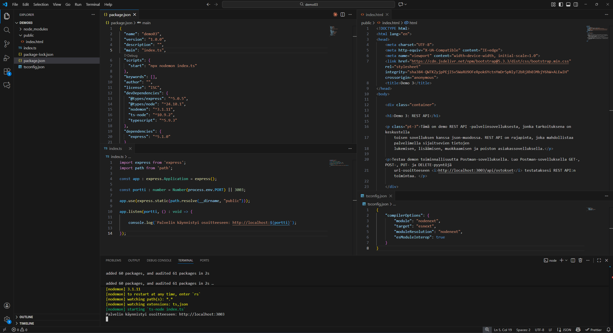

#### Etusivun tulostus Postmanilla
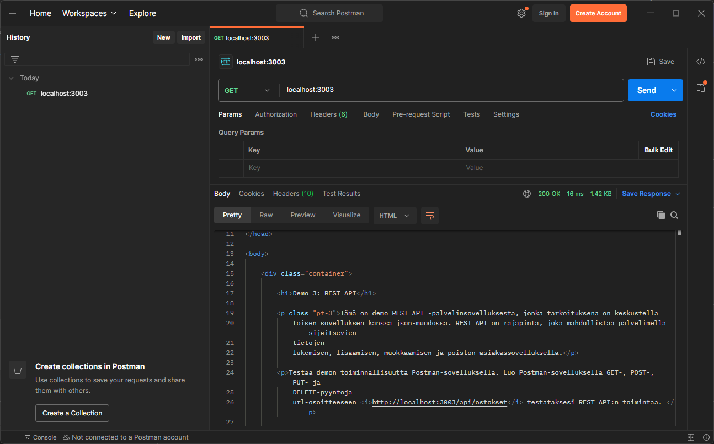

## 2 Ostoslistan tietomallin määrittäminen

Aloitetaan ohjelmointi määrittämällä sovelluksen tietomalli ostosten käsittelyä varten. Edellisessä demossa 2 tutustuttiin jo tietomallin määrittämiseen TypeScript interfacella json-tyyppiseen tietorakenteeseen luomalla `Kayttaja`-tietomalli ja palauttamalla palvelimella json-muotoisia käyttäjiä perustuen erilaisiin hakutermeihin.

Tässä demossa tietomallia viedään pidemmälle ja tehdään rakenteesta enemmän oikean tietokannan tyylinen. Toteutamme ostoslista-sovellukseen yksittäisen ostoksen mallin sekä kaikkien ostosten käsittelyn toiminnot kokonaan samassa tiedostossa. Varsinaiset tietomallin muotoiset ostokset sijaitsevat nyt erillään oikeasti json-muodossa. Json-tiedoston ostoksia käsitellään ostoslista-tietomallin kautta käyttäen hyväksi File System -metodeja, eli manipuloimme suoraan json-tekstitiedostoa ohjelmallisesti. Tällä havainnollistetaan oikean tietokannan toimintaa ottamatta tietokantoja vielä käyttöön.

Välimainintana sanottakoon, että suoraviivaisin tapa toteuttaa ostoslistan käsittely olisi luoda yksittäisen ostoksen malli suoraan palvelimen juuritiedostoon `index.ts` ja toteuttaa array-muuttujaan Ostos-objekteja sisältävä lista, jota käsitellään suoraan reittikäsittelijöiden kautta. Tässä demossa tarkoituksena on kuitenkin havainnollistaa REST API -tekniikoita eristämällä ostosten käsittelyyn tarkoitetut reitit omaan api-tiedostoonsa ja tekemällä ostoksista oma tietomalli. Pointtina on eritellä erilliset toiminnot omiin loogisiin paikkoihinsa palvelimella. Tämä parantaa koodin luettavuutta ja ylläpidettävyyttä.

### 2.1 Ostos-objekti

Aloitetaan yksittäisen ostoksen määrittämisestä ja tietomallin luomisesta. Luodaan palvelimelle kansio `/models`. Luodaan kansion alle tyhjä `ostoslista.ts` -tiedosto.

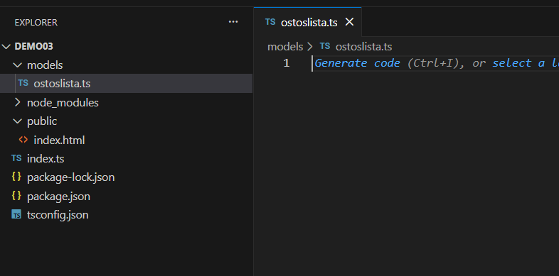

Ensimmäinen onglema ratkaistavaksi tässä vaiheessa on se, että minkälaisia tietueita ostoslista-taulumme sisältää. Tämän ongelman ratkaisu riippuu kehitettävän sovelluksen käyttötarkoituksesta, tarvittavista toiminnoista ja tiedoista, joita halutaan käsitellä. Koska rakennamme ostoslista-sovellusta, jossa ostoksia voidaan listata, käsitellä ja merkitä poimituksi, voimme toteuttaa yksittäiselle ostokselle seuraavan tietorakenteen objektina (lisätään rivit `ostoslista.ts` -tiedostoon):

#### ostoslista.ts
```typescript
interface Ostos {
    id : number,
    tuote : string,
    poimittu : boolean
}
```

Voimme tässä vaiheessa luoda `Ostos`-objekteja sisältävän json-tiedoston mallintamaan tietokantatiedostoamme. Nimetään tiedosto `ostokset.json` ja luodaan se `/models`-kansion alle. Lisätään tietokantaan 3 ostosta yllä määritetyllä ostoksen rakenteella.

#### ostokset.json
```json
[
    {
        "id" : 1,
        "tuote" : "Maitoa",
        "poimittu" : false
    },
    {
        "id" : 2,
        "tuote" : "Leipää",
        "poimittu" : false
    },
    {
        "id" : 3,
        "tuote" : "Ketsuppia",
        "poimittu" : false
    }
]
```

Tässä vaiheessa tiedostorakenteemme näyttää tältä:

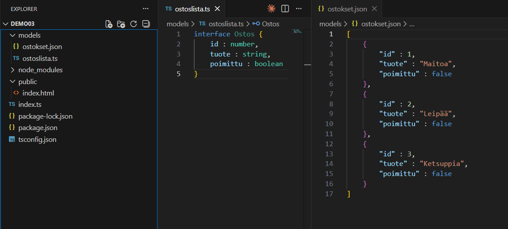

### 2.2 Tietokannan manipulointi

Seuraavaksi pitäisi ratkaista, miten ostoksia voidaan käsitellä tietokantatiedostossa. Tässä demossa simuloimme tietokannan käsittelyä hyödyntämällä File System -metodeja, joilla voidaan lukea ja muokata tekstitiedostoja.

Aloitetaan luomalla `ostoslista.ts`-tiedostoon luokka `Ostoslista` ja määrittämällä sille **muodostin** (constructor).

```typescript
import { readFile, writeFile } from 'fs/promises'; // Tuodaan tiedoston käsittelyä varten File System -metodit readFile ja writeFile. Tuodaan promises-versiot asynkroonista käsittelyä varten.
import path from 'path'; // Tuodaan tiedoston polun muodostamista varten path-metodit.

// interface Ostos {...}

class Ostoslista {

    // Ostokset luetaan tietokannasta ja sijoitetaan ostokset-muuttujaan. Muuttuja on taulukko (array), joka sisältää Ostos-objekteja.
    private ostokset : Ostos[] = [];

    /*
    File System tarvitsee tiedon ostokset-tietokannan sijainnista palvelimella.
    Käytetään tähän path-metodeilla muodostettavia polkuja.
    Tiedoston polku löytyy tästä työskentelysijainnista yhdistettynä tietokannan tiedostonimeen.
    */
    private tiedosto : string[] = [__dirname, "ostokset.json"]; 

    constructor() {

        readFile(path.resolve(...this.tiedosto), "utf8") // Luetaan File Systemin readFile-metodilla ostokset.json -tiedoston sisältö
        .then((data : string) => { // Muodostetaan tietokannan sisältämästä json-datasta merkkijono
            this.ostokset = JSON.parse(data); // Parsitaan tietokannasta luettu merkkijono json-muotoisiksi objekteiksi ja sijoitetaan data ostokset-taulukkoon
        })
        .catch((e : any) => { // Varaudutaan virheisiin poimimalla (catch) mahdolliset virheet ja tulostamalla ne (throw new Error(e))
            throw new Error(e);
        });

    }

}
```

Koodia tulee tässä vaiheessa paljon. Kaikkea ei tarvitse täysin ymmärtää, etenkin kun siirrymme tulevissa demoissa oikeiden tietokantojen käsittelyyn. Riittää, että voi kopioida oheisen mallin ja soveltaa sitä muihin REST API -sovelluksiin.

Käytännössä, kun käsittelemme ostokset-tietokantaa TypeScript-tiedostosta käsin, meidän pitää jotenkin lukea tietokannan sisältö ja alustaa se muuttujaan, jotta tiedostoja voidaan käsitellä ohjelmallisesti. Tätä varten tarvitsemme muodostimen, joka `Ostoslista`-luokan ilmentymää luotaessa suoritetaan automaattisesti. Muodostimessa tietokantatiedoston `ostokset.json` sisältö luetaan ja tallennetaan `ostokset`-taulukkoon, jos sisältöä on.

Luodaan luokalle vielä metodi, jolla voimme hakea kaikki ostokset tietokannasta:

```typescript
// imports

// interface Ostos {...}

class Ostoslista {

    // Muuttujat
    // Constructor

    public haeKaikki = () : Ostos[] => { // Luodaan metodi haeKaikki, jota kutsumalla Ostoslista-luokka palauttaa kaikki tietokannan ostokset

        try {
            return this.ostokset;
        } catch (e : any) {
            throw new Error(e);
        }

    }

}
```

Metodi `haeKaikki()` palauttaa `Ostos`-tyyppisiä objekteja sisältävän taulukon, ellei tapahdu joku virhe. Metodiin pitää määrittää try-catch -rakenne, koska voi olla, että tietokantaan ei saada yhteyttä (tiedostoa ei ole, väärä tiedostonimi jne.) tai tietokanta on tyhjä. Metodista on tehtävä julkinen `public` avainsanalla, jotta siihen voidaan viitata `ostoslista.ts`-tiedoston ulkopuolelta.

### 2.3 Tietokannan testaaminen

Tässä vaiheessa meillä on toiminnallisesti kaikki koodit, jotta voimme testata tietokantamme toimintaa. Jotta tietokantaa voidaan käyttää palvelinsovelluksessa, se pitää voida ensinnäkin tuoda osaksi muita koodeja. Määritetään `ostoslista.ts`-tietomallista sekä `Ostos`-tyyppi, että `Ostoslista`-luokka tuotaviksi ominaisuuksiksi `export`-avainsanalla.

```typescript
// imports

export interface Ostos {...}

class Ostoslista{...}

export default Ostoslista;
```

Tämän jälkeen voimme testata tietokantaa tuomalla sen palvelimen juureen `index.ts` ja luomalla reittikäsittelijän johonkin reittiin, jossa ostokset palautetaan json-muodossa. Luodaan nyt palvelimen juureen reittikäsittelijä reittiin `/ostokset`. `Ostoslista`-luokka ja `Ostos`-tyyppi pitää myös tuoda osaksi palvelinsovellusta `./models`-kansiosta.

```typescript
// imports
import Ostoslista, { Ostos } from './models/ostoslista'; // Tuodaan Ostoslista-luokka ja Ostos-tyyppi ostoslista-tietomallista

const ostoslista : Ostoslista = new Ostoslista(); // Luodaan Ostoslista-luokasta ilmentymä muuttujaan ostoslista

// const app...
// const portti...

// app.use(express.static...);

app.get("/ostokset", (req : express.Request, res : express.Response) => {
    res.json(ostoslista.haeKaikki());
});

// app.listen(...);
```

Kiinnitä huomiota `import`-komentoon. Koska `Ostoslista`-luokka määritettiin `ostoslista.ts`-tietomallin vakiotuonniksi (export default), se tuodaan sellaisenaan nimellään. Kaikki toissijaiset tuonnit tuodaan aaltosulkeiden välissä, kuten `Ostos`-tyyppi. Kutsumalla ostokset-reittiä Postmanilla tietokannan pitäisi palauttaa sinne malliksi luodut kolme ostosta:

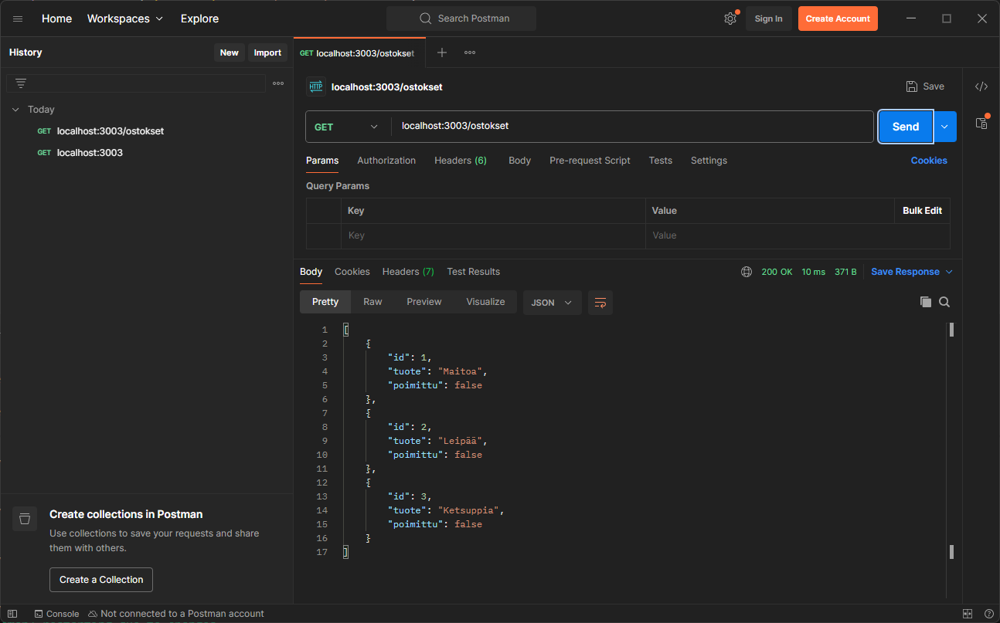

Olemme selättäneet ensimmäisen ison esteen ja luoneet toimivan tietomallin `ostoslista.ts` ja yhteyden tietokantatiedostoon `ostokset.json`. Voimme käsitellä tietokantaa luomalla `Ostoslista`-luokasta **ilmentymän** (instance) ja kutsumalla siihen määritettyjä tietokannan käsittelyn metodeja kuten `haeKaikki()`.

### 2.4 Tietomallin viimeistely

Pelkkä kaikkien ostosten hakeminen ei riitä ostoslista-sovelluksen toiminnallisuudeksi. Haluamme myös lisätä, muokata ja poistaa ostoksia. Myös yksittäisen ostoksen hakeminen perustuen id-tunnisteeseen on hyvä havainnollistaa osana REST API -sovelluksen toimintaa.

Tässä vaiheessa on hyvä pysähtyä miettimään, mitä ostosten muokkaaminen vaatii teknisessä mielessä. Meidän pitää toki muokata `Ostoslista`-luokan `ostokset`-muuttujan sisältöä, mutta miten se tapahtuu käytännössä? Pelkkä ostosten päivittäminen muuttujaan ei myöskään riitä, vaan muuttuneet tiedot pitää saada päivitettyä varsinaiseen tietokantatiedostoon pitkäaikaista säilytystä varten. Ostoslista-sovelluksen sammuessa muuttujat menettävät arvonsa, mutta päivitetty `ostokset.json`-tiedosto säilyttää muutokset tallennettaessa.

Tarkastellaan tarvittavia toimintoja ostoksen lisäämisen kautta. Lisätty ostos pitää ensin päivittää `ostokset`-muuttujaan ja sitten vielä erikseen tallentaa `ostokset.json`-tietokantatiedostoon. Koska ostoksia muutetaan myös päivittäessä ja poistettaessa, luodaan tiedostoon tallentamiselle kokonaan oma metodi, jota kutsutaan tietoja päivittäessä. Lisätään `ostoslista.ts`-tietomallin `Ostoslista`-luokkaan seuraavat metodit:

```typescript
// imports

// interface Ostos {...}

class Ostoslista {

    // Muuttujat
    // Constructor

    // public haeKaikki = () : Ostos[] => {...}

    public lisaa = async (uusiOstos: Ostos) : Promise<void> => {
        try {
            this.ostokset = [
                ...this.ostokset,
                {
                id: this.ostokset.sort((a: Ostos, b: Ostos) => a.id - b.id)[this.ostokset.length - 1].id + 1, // Järjestellään ostokset id:n mukaan suuruusjärjestykseen ja lisätään viimeisimpään id-arvoon yksi
                tuote: uusiOstos.tuote,
                poimittu: uusiOstos.poimittu,
                },
            ];

            await this.tallenna(); // Kutsutaan alla määriteltyä tallenna-metodia asynkroonisesti.
        } catch (e: any) {
            throw new Error(e);
        }
    };

  private tallenna = async () : Promise<void> => {
    try {
      await writeFile(
        path.resolve(...this.tiedosto),
        JSON.stringify(this.ostokset, null, 2),
        "utf8"
      );
    } catch (e: any) {
      throw new Error(e);
    }
  };

}

export default Ostoslista
```

`lisaa()`-metodi ottaa parametrina vastaan `Ostos`-tyypin objektin nimellä uusiOstos ja tallentaa sen `Ostoslista`-luokan ilmentymässä olevaan `ostokset`-taulukkoon. Metodi on julkinen (public), jotta siihen voidaan viitata tietomallin ulkopuolella. `tallenna()`-metodi kirjoittaa päivitetyn `ostokset`-taulukon `ostokset.json`-tietokannan uudeksi arvoksi käytännössä ylikirjoittaen vanhat tiedot. Koodia on paljon ja etenkin ostoksen lisäämisessä tapahtuu paljon asioita. Etenkin taulukon järjestelyn metodi `sort()` voi aiheuttaa hämmennystä, jos metodi ei ole tuttu entuudestaan. Käydään metodien logiikkaa tarkemmin läpi alla:

#### lisaa-metodi

1. Metodi määritellään asynkrooniseksi (async). Asynkroonisissa funktioissa voidaan jäädä odottamaan (await) jonkin toiminnan suoriutumista ennen ohjelmakoodin suorittamisen jatkamista eteenpäin. Tämä tehdään siksi, että yleisesti tietokantojen käsittelyssä voi kestää hetki. Jos funktio ei olisi määritetty asynkrooniseksi, ohjelman suoritus jatkuisi ennen kuin tietokantaa olisi ehditty päivittämään, joka johtaisi ongelmiin.
2. Metodi ottaa vastaan tietoa, eli sille määritellään parametri `uusiOstos`, joka on `Ostos`-tyyppiä (TypeScriptin vahvan tyypityksen hyödyntäminen). Metodi ei palauta mitään, eli sen tyyppi on void (tyhjä palautus), mutta koska metodi on asynkrooninen, pitää palauttaa lupaus tyhjästä `Promise<void>`. Käytännössä aina kun käsitellään asynkroonisia metodeja, ne palauttavat lupauksen (promise).
3. `Ostoslista`-luokan ilmentymässä olevan `ostokset`-taulukon tiedot päivitetään käyttäen hyväksi spread-operaatiota (`...this.ostokset`). "Spreadauksessa" taulukon tiedot kopioidaan muokattavaan muotoon ja niitä jatketaan uudella tiedolla, joka on tässä tilanteessa objektin muodossa, koska yksittäinen `Ostos` on objekti. Spread-operaation syntaksi on yksinkertaistettuna `taulukko = [...taulukko, uusiTieto];`.
    - Taulukkoon lisättävän ostoksen id muodostetaan järjestelemällä olemassa olevat ostokset `id`:n arvon perusteella suuruusjärjestykseen pienimmästä suurimpaan. Tämä tehdään varmistaaksemme sen, että taulukon viimeisimmällä tietueella on suurin `id`-arvo. Arvoon lisätään yksi, joka määritetään uuden ostoksen id-arvoksi.
    - Taulukkoon lisättävän ostoksen tuote- ja poimittu-tieto saadaan funktion argumentista (eli uuden ostoksen arvo sijoitetaan parametrin tilalle metodia kutsuttaessa)
4. Kun ostokset-taulukko on päivitetty uuden ostoksen tiedoilla, kutsutaan `tallenna()`-metodia, joka ylikirjoittaa `ostkoset.json`-tietokantatiedoston sisällön tallentaen päivitetyt tiedot.

#### tallenna-metodi

1. Metodin rakenne on samanlainen kuin `lisaa()`-metodissa. Metodi määritellään asynkrooniseksi ja siinä kutsutaan File Systemin `writeFile()`-metodia.
2. `writeFile()` ottaa argumentteina vastaan `ostokset.json`-tiedoston polun ja json-merkkijonoksi muotoillun `ostokset`-taulukon sisällön.

#### Muut tietokannan käsittelyn metodit

Päivitetään `ostoslista.ts`-tietomalliin loputkin tietokannan käsittelyn metodit.

```typescript
// imports

// interface Ostos {...}

class Ostoslista {

    // Muuttujat
    // Constructor

    // public haeKaikki = () : Ostos[] => {...}

    public haeYksi = (id : number) : Ostos | undefined => {

        try {
            return this.ostokset.find((ostos : Ostos) => ostos.id === id);
        } catch (e : any) {
            throw new Error(e);
        }         

    }

    // public lisaa = async (uusiOstos: Ostos) : Promise<void> => {...}
    
    public muokkaa = async (muokattuOstos : Ostos, id : number) : Promise<void> => {

        try {
            
            this.ostokset = this.ostokset.filter((ostos : Ostos) => ostos.id !== id);

            this.ostokset = [
                ...this.ostokset,
                {
                    id : id,
                    tuote : muokattuOstos.tuote,
                    poimittu : muokattuOstos.poimittu
                }    
            ].sort((a : Ostos, b : Ostos) => a.id - b.id);

            await this.tallenna();

        } catch (e : any) {
            throw new Error(e);
        }         

    }

    public poista = async (id : number) : Promise<void> => {

        try {
            
            this.ostokset = this.ostokset.filter((ostos : Ostos) => ostos.id !== id);

            await this.tallenna();

        } catch (e : any) {
            throw new Error(e);
        }         

    }

    // private tallenna = async () : Promise<void> => {...}
}

export default Ostoslista
```

Metodien toimintaa voi selvittää kopioimalla koodinpätkän tekoälylle ja pyytämällä sitä selittämään, mitä koodissa tapahtuu.

### 2.5 Tietomallin testaaminen muilla metodeilla

Tässä vaiheessa meillä on käytännössä kaikki tietokannan käsittelyyn liittyvät metodit ja voimme testata, että sovellus toimii tähän asti. Lisätään palvelimen juureen `index.ts` reittikäsittelijät myös muille metodeille ostosten hakemiselle, muokkaamiselle ja poistamiselle:

```typescript
import express from 'express';
import path from 'path';
import Ostoslista, { Ostos } from './models/ostoslista';

const ostoslista : Ostoslista = new Ostoslista();
const app : express.Application = express();
const portti : number = Number(process.env.PORT) || 3003;

app.use(express.static(path.resolve(__dirname, "public")));

app.use(express.json()); // Määritetään express-palvelin käyttämään json-muotoista dataa. Tämä tarvitaan json-datan poimimiseen pyynnön bodysta

app.get("/ostokset", (req : express.Request, res : express.Response) => {
    res.json(ostoslista.haeKaikki());
});

app.get("/ostokset/:id", (req : express.Request, res : express.Response) => { // Yhden ostoksen hakeminen id:n perusteella. Id annetaan reittiparametrina
    res.json(ostoslista.haeYksi(Number(req.params.id)));
});

app.post("/ostokset", async (req : express.Request, res : express.Response) => { // Ostoksen lisääminen tietokantaan.
    
    let uusiOstos : Ostos = { //Ostoksen tiedot saadaan pyynnön bodysta.
        id : 0,
        tuote : req.body.tuote,
        poimittu : req.body.poimittu
    }

    await ostoslista.lisaa(uusiOstos); // Kutsutaan ostoslistan lisaa-metodia uuden ostoksen tiedoilla
    
    res.json(ostoslista.haeKaikki()); // Haetaan lopuksi päivitetyt ostokset reittikäsittelijän vastaukseksi
});

app.put("/ostokset/:id", async (req : express.Request, res : express.Response) => { // Ostoksen päivittäminen id:n perusteella
    
    let muokattuOstos : Ostos = { // Ostoksen päivitetyt tiedot saadaan pyynnön bodysta
        id : req.body.id,
        tuote : req.body.tuote,
        poimittu : req.body.poimittu
    }

    await ostoslista.muokkaa(muokattuOstos, Number(req.params.id)); // Kutsutaan ostoslistan muokkaa-metodia
    
    res.json(ostoslista.haeKaikki());
});

app.delete("/ostokset/:id", async (req : express.Request, res : express.Response) => { // Ostoksen poistaminen id:n perusteella

    await ostoslista.poista(Number(req.params.id));
    
    res.json(ostoslista.haeKaikki());
});

app.listen(portti, () : void => {

    console.log(`Palvelin käynnistyi osoitteeseen: http://localhost:${portti}`);

});
```

Testataan jokaista reittiä Postman-sovelluksella:

#### Yhden tuotteen haku

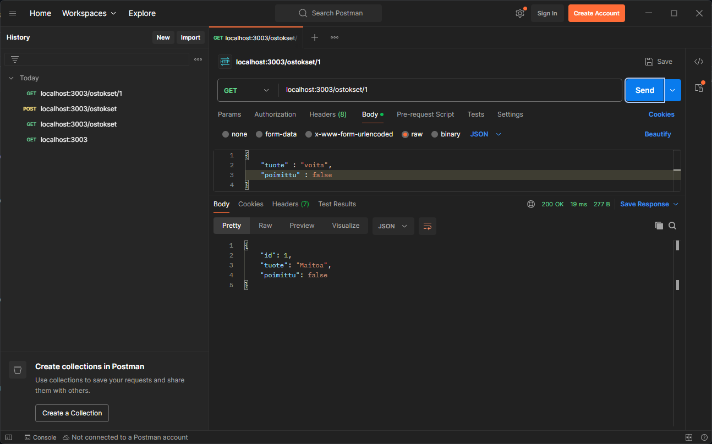

#### Tuotteen lisääminen

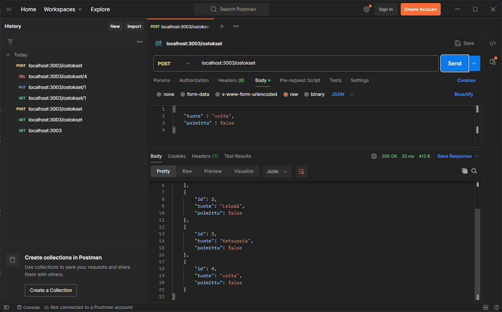

#### Tuotteen muokkaaminen

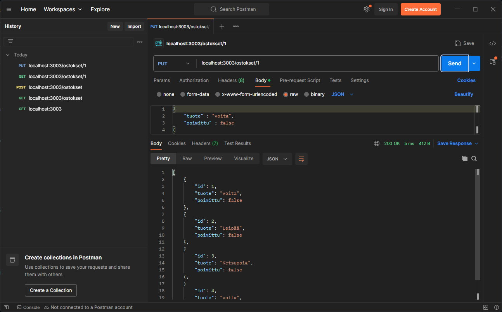

#### Tuotteen poistaminen

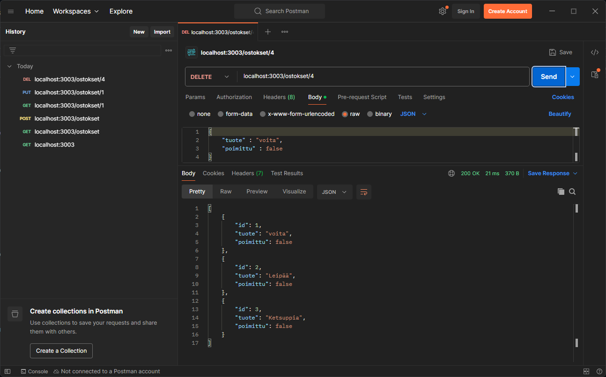

## 3 Ostoslista-sovelluksen REST API määrittäminen

Nyt ostoslistasovellus on teknisesti valmis. Sovellus ei kuitenkaan vielä ole REST APIn mukainen, koska ostosten käsittely tapahtuu palvelimen juuressa. Palvelinsovelluksessa voisi olla myös muitakin toimintoja kuin pelkkä ostoslistan käsittely. Ostoslistan käsittely on kuitenkin oma erillinen kokonaisuutensa. Jos palvelimen kehittämistä jatkaisi muilla reiteillä liittyen täysin muihin toimintoihin, katoaisi nopeasti käsitys siitä, mitkä palvelimen reiteistä liittyvät samaan toiminnallisuuteen. Tätä varten REST API:ssa palvelimen eri ns. business-logiikan rajapinnat eritellään omiksi kokonaisuuksiksiin reitityksellä. Tähän käytämme Express Routeria.

### 3.1 Luodaan ostosten käsittelyn rajapinta Express Routerilla

Luodaan palvelimen juureen uusi kansio `/routes` rajapintojen reitityksiä varten. Luodaan kansioon uusi tiedosto `apiOstokset.ts`.

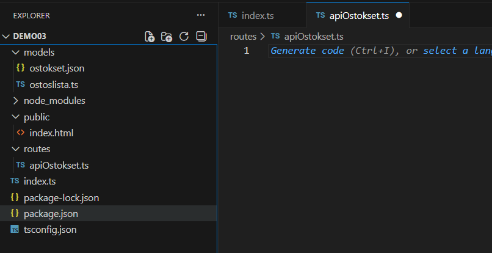

Rajapinta on palvelimen juuritiedostosta `index.ts` erillinen tiedosto, mutta siitä voidaan tehdä toiminnallinen osa Express-palvelinta tuomalla tähänkin Expressin ominaisuudet:

```typescript
import express from 'express';
```

Seuraavaksi käytämme Express Routeria muodostamaan yhteyden palvelimen juuren ja rajapinnan välille:

#### apiOstokset.ts
```typescript
import express from 'express';

const apiOstoksetRouter : express.Router = express.Router();

export default apiOstoksetRouter;
```

#### index.ts
```typescript
// imports

import apiOstoksetRouter from './routes/apiOstokset'; // Tuodaan luotu apiOstoksetRouter palvelimelle, eli yhdistetään palvelimen osat toisiinsa.

const app: express.Application = express();
const portti: number = Number(process.env.PORT) || 3003;

app.use(express.static(path.resolve(__dirname, "public")));

app.use("/api/ostokset", apiOstoksetRouter); // Otetaan reititys käyttöön palvelimessa. Reittiin päästään käsiksi annetulla osoitteen jatkeella /api/ostokset

// Ostoslistan reittikäsittelijät yms.

app.listen(portti, (): void => {
  console.log(`Palvelin käynnistyi osoitteeseen: http://localhost:${portti}`);
});
```

### 3.2 Viedään ostoslistan reittikäsittelijät apiOstokset-rajapinnan taakse

Seuraavaksi voimmekin vain leikata aiemmassa vaiheessa luomamme ostoslista-tietokannan käsittelyyn luomamme reittikäsittelijät ja muut komennot palvelimen juuritiedostosta ja liittää ne `apiOstokset.ts`-rajapintaan. Muutetaan reittikäsittelijöitä niin, että Express-sovelluksen `app` sijasta kutsutaankin `apiOstoksetRouter`-rajapinnan HTTP-metodeja:

#### apiOstokset.ts
```typescript
import express from 'express';
import Ostoslista, { Ostos } from '../models/ostoslista'; // Siirrettiin Ostoslistan tuonti rajapintaan

const ostoslista : Ostoslista = new Ostoslista(); // Siirrettiin Ostoslistan ilmentymän luonti rajapintaan

const apiOstoksetRouter : express.Router = express.Router();

apiOstoksetRouter.use(express.json()); // Siirrettiin express.json() käyttä rajapintaan pyynnön bodysta tulevan json-tiedon käsittelyä varten. Tätä ei enää tarvita palvelimen juuressa.

// Tuodaan ostoslista-tietokannan reittikäsittelijät palvelimen juuresta ja vaihdetaan kutsuvaksi vakioksi apiOstoksetRouter. Muuten reittikäsittelijöiden koodit pysyvät ennallaan.

apiOstoksetRouter.get("/", (req : express.Request, res : express.Response) => {

    res.json(ostoslista.haeKaikki());
});

apiOstoksetRouter.get("/:id", (req : express.Request, res : express.Response) => {

    res.json(ostoslista.haeYksi(Number(req.params.id)));
});

apiOstoksetRouter.post("/", async (req : express.Request, res : express.Response) => {

    let uusiOstos : Ostos = {
                        id : 0,
                        tuote : req.body.tuote,
                        poimittu : req.body.poimittu
                    }

    await ostoslista.lisaa(uusiOstos);

    res.json(ostoslista.haeKaikki());
});

apiOstoksetRouter.put("/:id", async (req : express.Request, res : express.Response) => {

    let muokattuOstos : Ostos = {
        id : req.body.id,
        tuote : req.body.tuote,
        poimittu : req.body.poimittu
    }

    await ostoslista.muokkaa(muokattuOstos, Number(req.params.id));

    res.json(ostoslista.haeKaikki());
});

apiOstoksetRouter.delete("/:id", async (req : express.Request, res : express.Response) => {
    
    await ostoslista.poista(Number(req.params.id));

    res.json(ostoslista.haeKaikki());
});

export default apiOstoksetRouter;
```

#### index.ts

Leikattiin ostoslista-tietokannan käsittelyyn liittyvät koodit pois palvelimen juuresta. Nyt palvelimen pystyttämiseen käytettävä koodi on siistissä ja luettavassa muodossa. Palvelin kuvaa eksplisiittisesti, että käyttöön on otettu erillinen `/api/ostokset`-reititys, joka tulee `/routes/apiOstokset`-sijainnista.

```typescript
import express from "express";
import path from "path";
import apiOstoksetRouter from './routes/apiOstokset';

const app: express.Application = express();

const portti: number = Number(process.env.PORT) || 3003;

app.use(express.static(path.resolve(__dirname, "public")));

app.use("/api/ostokset", apiOstoksetRouter);

app.listen(portti, (): void => {
  console.log(`Palvelin käynnistyi osoitteeseen: http://localhost:${portti}`);
});
```

### 3.3 REST API Ostoslista-sovelluksen testaaminen kutsumalla apiOstoksetRouterin reittejä

Nyt palvelinsovelluksemme on valmis. Aluksi loimme palvelimellemme business-logiikan ostokset-tietokannan käsittelylle erillisellä ostoslista-tietomallilla ja sen käsittelyyn käytettävillä reittikäsittelijöillä. Kun sovelluksen tekninen toiminnallisuus oli valmis, siirsimme ostoslistan käsittelyyn käytettävät koodit pois palvelimen juuresta erillisen rajapinnan taakse, jota voidaan kutsua nyt Postmanilla. Koska reititämme kutsut, joudumme jatkamaan palvelimen osoitetta rajapintamme polulla `/api/ostokset`. Muuten toiminta on sama. Testataan muutamilla pyynnöillä:

#### Ostosten hakeminen
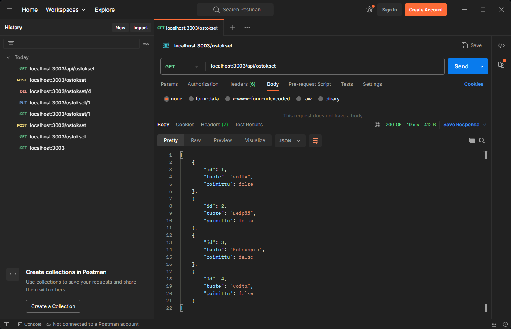

#### Uuden ostoksen lisääminen


#### Yksittäisen ostoksen hakeminen
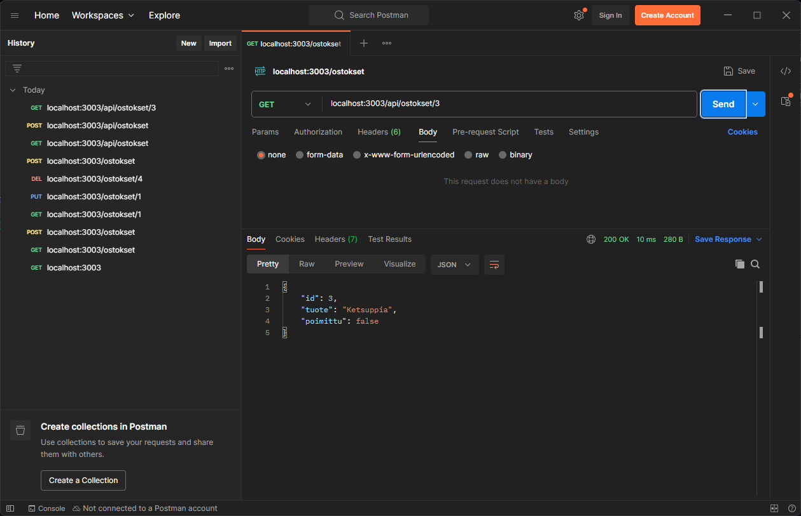

## 4 Lopuksi

Tämä päättää vaiheittaisen ohjeistuksen REST API -tyylisen verkkopalvelun ohjelmoinnista. Toteutimme ostoslista-sovelluksen, jolla voidaan hakea ja muokata erillisessä tietokantatiedostossa olevia ostoksia. Hyödynsimme tähän itse kehittämäämme tietomallia, joka tarjoaa metodit tietokannan käsittelylle. Palvelimen reittikäsittelijöissä kutsuttiin tietokannan käsittelyn metodeja REST APIn sääntöjen mukaisesti (GET-metodi hakee, POST-metodi lisää jne.). Lopuksi erittelimme ostokset-tietokannan käsittelyyn liittyvät toiminnot palvelimella omaan rajapintaansa, joka teki sovelluksemme rakenteesta selkeämmän ja helpommin ylläpidettävän.

Tässä on tiivistettynä REST API -tyyppisten sovellusten idea. Sen sijaan, että kaikki mahdolliset toiminnot ja niiden komennot kirjotettaisiin yhteen pötköön, hyödynnämme Node:n modulaarisuutta ja rakennamme loogisista palikoista koostuvan sovelluksen, jossa samat toiminnot keskitetään omiin ohjelmatiedostoihinsa.

Tulevissa demoissa toteutamme lisää REST API -sovelluksia, mutta otamme oikeat tietokannat käyttöön Prisma ORM -ohjelmistolla. Oikeassa elämässä tietokantoja ei toteutettaisi tämän demon tavalla json-tiedostoon, jota käsitellään itse ohjelmoitavalla tietomallilla. Tässä demossa tarkoitus oli vain havainnollistaa, mitä tulevissa demoissa tapahtuu konepellin alla, kun tietokannan käsittely siirretään kokonaan erillisen sovelluksen hoidettavaksi.