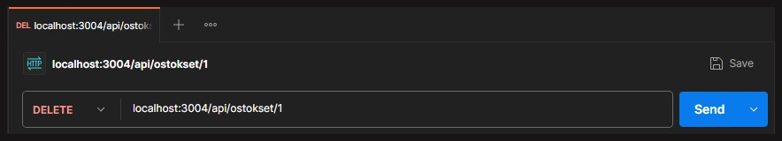
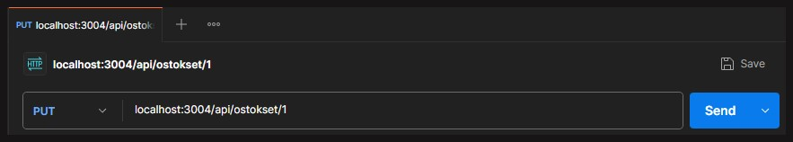
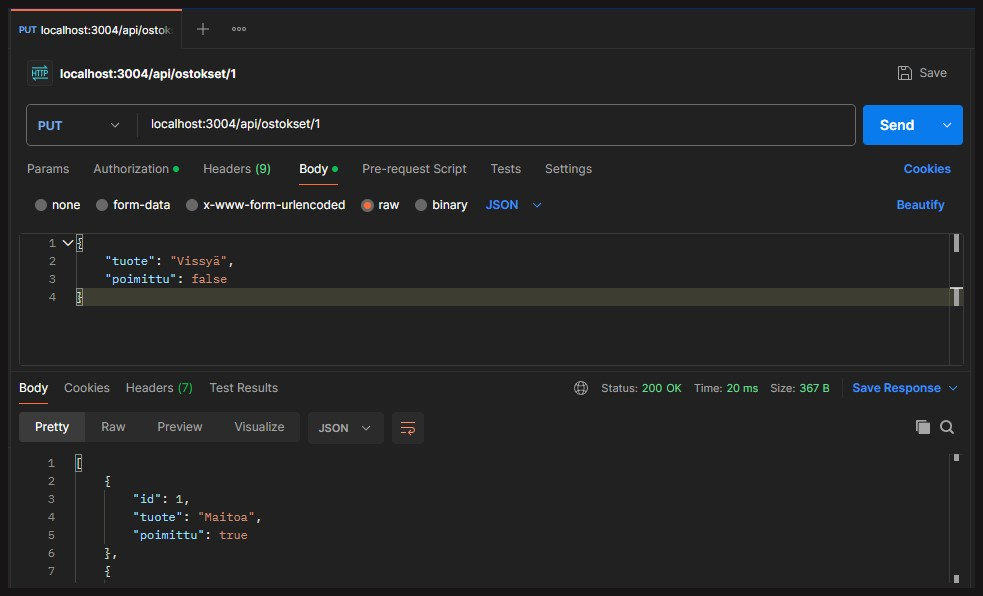
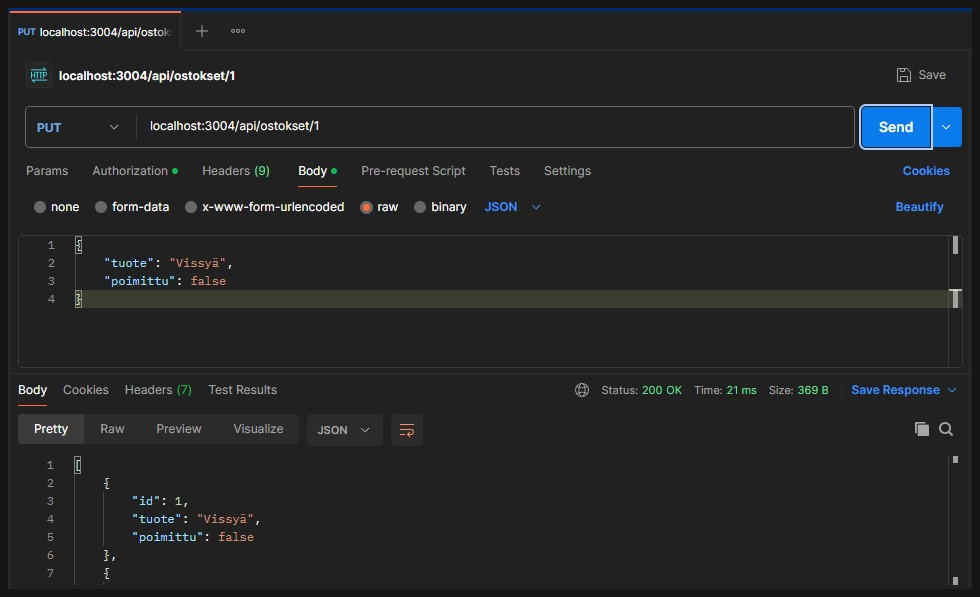
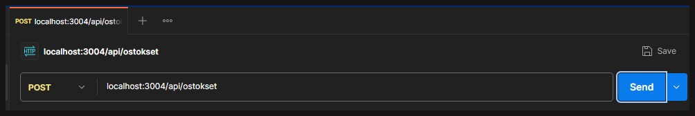
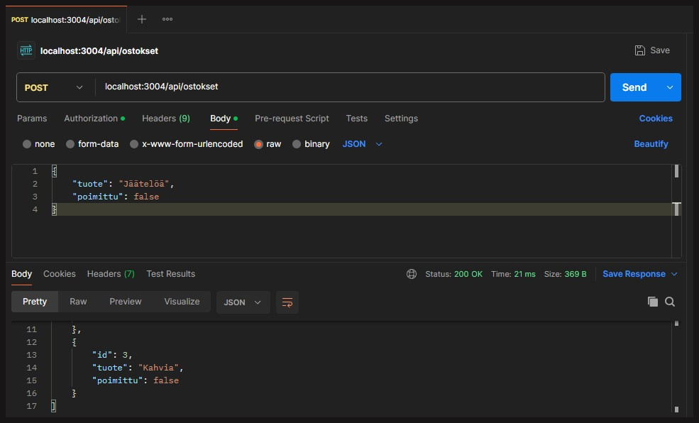
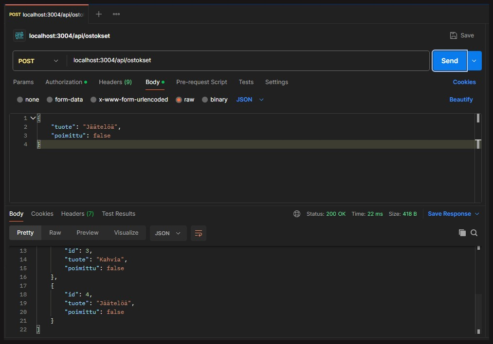

# Ostokset API - Ostosten käsittelyn rajapinta

### [<- Takaisin](../README.md)

[`apiOstokset.ts`](../routes/apiOstokset.ts) määrittää rajapinnan ostosten käsittelylle. Rajapinta määrittää ne kaikki reitit, joiden kautta asiakas voi käsitellä ostoksia. Rajapinnan reittikäsittelijöissä otetaan vastaan asiakkaan lähettämän pyynnön otsikkotiedot, joita mahdollisesti käytetään taustajärjestelmässä olevien tietojen käsittelyyn.

Kaikki reitit eivät ota vastaan samoja tietoja. Esimerkiksi ostosten hakemisessa ["tietokantaa"](../models/ostokset.json) ei muokata, vaan sieltä vain haetaan tiedot. Jos halutaan kaikki tiedot, ei pyynnön mukana tarvitse antaa tarkempia tietoja. Jos halutaan hakea tietty tietue, pyynnön reitissä on määritelty erikseen id, jolla tuote haetaan, mutta muuten otsikkotiedoissa ei ole mitään ostoksiin viittaavaa.

Lisäyksen, muokkauksen ja poiston reittien yhteydessä vastaan otetaan otsikkotietoina käsiteltävä ostos.

"Tietokanta" kirjoitetaan tämän demon dokumentaatiossa lainausmerkeillä, koska teknisesti kyseessä ei ole varsinainen tietokanta, vaan tiedot tallennetaan [json-tiedostoon](../models/ostokset.json), joka toimii vielä tässä vaiheessa tietokannan esityksenä. Seuraavassa demossa otetaan käyttöön oikea tietokanta.

## 1. Moduulien importit

```ts
import express from 'express';
import { Virhe } from '../errors/virhekasittelija';
import Ostoslista, { Ostos } from '../models/ostoslista';
```

Tuodaan rajapinnan tarvitsemat lisäosat käyttöön.

1. `import express from 'express'`: Tuodaan käyttöön express reitityksen määrittämiseksi.
2. `import { Virhe } from '../errors/virhekasittelija'`: Tuodaan käyttöön Virhe-luokka [virhekasittelija-tiedostosta](../errors/virhekasittelija.ts).
3. `import Ostoslista, { Ostos } from '../models/ostoslista'`: Tuodaan käyttöön Ostoslista-luokka ja Ostos-rajapinta [ostoslista-tiedostosta](../models/ostoslista.ts)


## 2. Uuden ostoslistan luonti

```ts
const ostoslista : Ostoslista = new Ostoslista();
```

Luodaan uusi ilmentymä [Ostoslista-luokasta](../models/ostoslista.ts). Ostoslista määrittää kaikki ominaisuudet ja toiminnot ostosten käsittelyyn. "Tietokanta" pysyy aina samana, mutta jokaiselle sessiolle pitää erikseen määrittää ilmentymä Ostoslistasta, jonka kautta "tietokantaa" käsitellään.

## 3. Express Routerin määritys ja middlewaret

```ts
const apiOstoksetRouter : express.Router = express.Router();
apiOstoksetRouter.use(express.json());
```

1. Määritetään vakio `apiOstoksetRouter`, joka on Expressin Router. Toisin sanoen tässä luomme reitittimen Ostokset API:lle, joka otetaan käyttöön [palvelimella (`index.ts`)](../index.ts). Kun router otetaan käyttöön palvelimella, router-middlewaren määrityksessä ensimmäiseksi parametriksi määritetään reitti, jota router käyttää Ostokset APIn välittämiseen. Tässä tilanteessa se on määritetty `/api/ostokset`. Eli kun reittiä käytetään osana asiakkaan pyyntöjä, pyynnöt ja niiden käsittely ohjataan [Ostokset APIin](../routes/apiOstokset.ts).
2. Määritetään Ostokset-router käyttämään json-middlewarea "tietokannan" tietojen käsittelyyn reittikäsittelijöissä.

## 4. Ostokset APIn reitit

Seuraavaksi määritellään Ostokset APIn reitit, eli erilaiset REST APIn mukaiset pyyntökäsittelijät, joilla ostoksia hallitaan. Käsittelijöissä määritetty `next`-parametri liittyy virheiden käsittelyyn, joista kerrotaan lisää [virheiden käsittelyn dokumentaatiossa](./REST-API-virhekäsittelijä.md).

Delete ja Put -reiteissä pitää muistaa määrittää metodin asynkroonisuus, koska käsitellään "tietokannan" tietoja, jossa voi kestää hetki. `async` määrittää, että ohjelma odottaa `await`-komentojen suorittamista, ennen kuin ohjelma jatkaa suorittamista eteenpäin. Ilman tätä määritystä voi käydä niin, että sovellus ei ehdi tehdä "tietokannan" käsittelyä ennen suorittamisen jatkamista ja tämä voi johtaa monenlaisiin virheisiin ja sovelluksen toimimattomuuteen.

### 4.1 Ostoksen poistaminen

```ts
apiOstoksetRouter.delete("/:id", async (req : express.Request, res : express.Response, next : express.NextFunction) => {

    if (ostoslista.haeYksi(Number(req.params.id))) {
        try {

            await ostoslista.poista(Number(req.params.id));

            res.json(ostoslista.haeKaikki());

        } catch (e : any) {
            next(new Virhe())
        }
    } else {
        next(new Virhe(400, "Virheellinen id"));
    }

});
```

Ostosten poistaminen tapahtuu HTTP DELETE -pyynnöllä. Reittinä käytetään Ostokset APIn juurta, jonka yhteydessä annetaan poistettavan ostoksen id. Kerrataan vielä, että kun reitti tässä kirjoitetaan `/:id`, niin pyynnön osoite **ei** ole <i>http://localhost:3004/:id</i>, vaan Ostokset APIn routerin määrittely asettaa palvelimelle ostosten käsittelyn reitin `/api/ostokset`, joka on nyt [tässä tiedostossa](../routes/apiOstokset.ts) "juurena". Oikea osoite on siis <i>http://localhost:3004/api/ostokset/:id</i>.

Postmanilla testatessa täytyy muistaa asettaa pyynnön metodiksi DELETE, jotta pyyntö menee oikein, koska samassa reitissä on nyt määritetty useampi eri käsittelijä.



#### Koodit tarkemmin

1. ```ts
    if (ostoslista.haeYksi(Number(req.params.id))) {...}
    ```
    [Ostoslista-luokassa](../models/ostoslista.ts) on määritelty metodi `haeYksi()`, joka ottaa parametrikseen id:n, joka on numero. Ostokset APIn Delete-käsittelijässä tarkistetaan, löytyykö pyynnön yhteydessä annetulla id:llä ostosta.

2. ```ts
    try {
        await ostoslista.poista(Number(req.params.id));
        res.json(ostoslista.haeKaikki());
        } ...
    ```
    Jos ostos löytyy, yritetään tehdä (`try {...}`) jotain, eli tässä poistaa ostos. Ostoslistan `poista()`-metodia kutsutaan, jossa annettua id:tä vastaava tuote poistetaan, jonka jälkeen haetaan ostoslistan kaikki tietueet ja palautetaan ne vastauksessa json-muotoisena (`res.json()`).

3. ```ts
    catch (e : any) {
            next(new Virhe())
        }
    ```

    Jos poiston yritys epäonnistui jostain syystä, tartutaan (`catch`) virheeseen, ja ajetaan `catch`-lohkon komento `next()`, eli tehdään jotain seuraavaksi. Tässä seuraavaksi muodostetaan uusi [Virhe-luokan](../errors/virhekasittelija.ts) ilmentymä. Tässä demossa Virheelle ei anneta mitään tarkempaa tietoa, joka tapahtuman (`e : any`) tiedoissa mahdollisesti olisi. Virhe määritellään geneerisenä 500-statuksena, joka on määritetty "Odottamattomaksi virheeksi".
    - `e` on yleinen tapa viitata johonkin tapahtumaan (event) ohjelman suorituksessa. Monesti tapahtuma sisältää erilaisia tarkempia tietoja tilanteesta, joka johti `catch`-lohkon suorittamiseen. Tässä ei kuitenkaan poimita erikseen tapahtuman tietoja näytettäväksi osana Virhe-ilmentymää, vaan palautetaan itse määrittelemämme geneerinen virheilmoitus, joka tehdään virhekäsittelijässä.

4. ```ts
    else {
        next(new Virhe(400, "Virheellinen id"));
    }
    ```

    Yllä määritellyn if-else -ehtolauseen else-lohko. Jos pyynnössä annettu id ei vastaa mitään ostokset-"tietokannan" tietuetta, palautetaan `next()`-komennolla uusi virhe, johon nyt on määritetty itse virheen status 400 ja virheilmoitus "Virheellinen id". Tämä siis kertoo hyvin selkokielisesti DELETE-pyynnön kutsujalle, että pyynnön yhteydessä annettu id on virheellinen, eikä vastaa mitään ["tietokannan"](../models/ostokset.json) -tietuetta.

### 4.2 Ostoksen muokkaaminen

```ts
apiOstoksetRouter.put("/:id", async (req : express.Request, res : express.Response, next : express.NextFunction) => {

    let muokattuOstos : Ostos = {
        id : req.body.id,
        tuote : req.body.tuote,
        poimittu : req.body.poimittu
    }

    if (ostoslista.haeYksi(Number(req.params.id))) {
        if (req.body.tuote?.length > 0 && (req.body.poimittu === true || req.body.poimittu === false)) {

            try {

                await ostoslista.muokkaa(muokattuOstos, Number(req.params.id));
        
                res.json(ostoslista.haeKaikki());
        
            } catch (e : any) {
                next(new Virhe())
            }

        } else {
            next(new Virhe(400, "Virheellinen pyynnön body"));
        }
    } else {
        next(new Virhe(400, "Virheellinen id"));
    }

});
```

Ostosten muokkaaminen tapahtuu HTTP PUT -pyynnöllä. Reittinä käytetään Ostokset APIn juurta, jonka yhteydessä annetaan muokattavan ostoksen id. Kerrataan vielä, että kun reitti tässä kirjoitetaan `/:id`, niin pyynnön osoite **ei** ole <i>http://localhost:3004/:id</i>, vaan Ostokset APIn routerin määrittely asettaa palvelimelle ostosten käsittelyn reitin `/api/ostokset`, joka on nyt [tässä tiedostossa](../routes/apiOstokset.ts) "juurena". Oikea osoite on siis <i>http://localhost:3004/api/ostokset/:id</i>.

Postmanilla testatessa täytyy muistaa asettaa pyynnön metodiksi PUT, jotta pyyntö menee oikein, koska samassa reitissä on nyt määritetty useampi eri käsittelijä.



#### Koodit tarkemmin

1. ```ts
    let muokattuOstos : Ostos = {
        id : req.body.id,
        tuote : req.body.tuote,
        poimittu : req.body.poimittu
    }
    ```

    Luodaan muokattavalle ostokselle apumuuttuja, joka käyttää Ostos-rajapintaa tiedon mallintamiseen. Tässä muokattavalle ostokselle annetaan pyynnön otsikkotiedoissa olevat tiedot.

    Otsikkotiedot annetaan Postmanilla pyynnön bodyssa kirjoitettuna json-muotoon. Koska id saadaan jo pyynnön yhteydessä osoiteriviltä, sitä ei määritetä osaksi pyynnön muuta bodya. Id kuitenkin poimitaan myös bodysta.

    Ennen muokkausta:
    

    Muokkauksen jälkeen:
    

2. ```ts
    if (ostoslista.haeYksi(Number(req.params.id))) {
        if (req.body.tuote?.length > 0 && (req.body.poimittu === true || req.body.poimittu === false)) {

            try {

                await ostoslista.muokkaa(muokattuOstos, Number(req.params.id));
        
                res.json(ostoslista.haeKaikki());
        
            } catch (e : any) {
                next(new Virhe())
            }

        } else {
            next(new Virhe(400, "Virheellinen pyynnön body"));
        }
    ```

    Muokattavan tuotteen hakeminen ostoksista tapahtuu samalla tavalla kuin delete-pyynnössä. Tällä kertaa haun jälkeen tarkistetaan, ovatko bodyssa annetut tiedot oikein. Tuote-tieto tarkistetaan vertaamalla tiedon pituutta nollaan (eli onko kirjoitettu minkään pituista merkkijonoa tuote-kohtaan). Poimittu-tieto tarkistetaan katsomalla, onko arvoksi annettu `true` tai `false`.

    Jos pyynnön otsikkotiedot ovat oikein, yritetään kutsua Ostoslista-luokan `muokkaa()`-metodia, joka ottaa parametreikseen ylempänä muodostetun, Ostos-rajapinnan mukaisen `muokattuOstos`-muuttujan tiedot ja id:n. Tämän jälkeen palautetaan pyynnössä json-muotoisesti kaikki ostokset muokkauksen jälkeen (katso kuva "muokkauksen jälkeen").

    Lopuksi on kaksi virheentarkistusta. Jos muokkauksen yrityksessä tapahtui jotain outoa, palautetaan geneerinen "Odottamaton virhe" `catch`-lohkossa. Jos koko otsikkotieto oli väärin (if-ehtolause), palautetaan itse kirjoittamamme virhe `400, "Virheellinen pyynnön body"`. Eli jälkimmäinen virhe palautetaan, jos otsikkotiedot eivät olleet ehtojen mukaiset (tuote-tiedossa merkkijono, joka on pidempi kuin nolla merkkiä ja poimittu-tieto on joko `true` tai `false`).

### 4.3 Ostoksen lisääminen

```ts
apiOstoksetRouter.post("/", async (req : express.Request, res : express.Response, next : express.NextFunction) => {

    let uusiOstos : Ostos = {
                        id : 0,
                        tuote : req.body.tuote,
                        poimittu : Boolean(req.body.poimittu)
                    }

    if (req.body.tuote?.length > 0) {

        try {

            await ostoslista.lisaa(uusiOstos);
    
            res.json(ostoslista.haeKaikki());
    
        } catch (e : any) {
            next(new Virhe())
        }

    } else {
        next(new Virhe(400, "Virheellinen pyynnön body"));
    }

});
```

Ostosten lisääminen tapahtuu HTTP POST -pyynnöllä. Reittinä käytetään Ostokset APIn juurta, jonka yhteydessä annetaan lisättävä ostos (ilman id:tä!). Kerrataan vielä, että kun reitti tässä kirjoitetaan `/`, niin pyynnön osoite **ei** ole <i>http://localhost:3004/</i>, vaan Ostokset APIn routerin määrittely asettaa palvelimelle ostosten käsittelyn reitin `/api/ostokset`, joka on nyt [tässä tiedostossa](../routes/apiOstokset.ts) "juurena". Oikea osoite on siis <i>http://localhost:3004/api/ostokset/</i>.

Postmanilla testatessa täytyy muistaa asettaa pyynnön metodiksi POST, jotta pyyntö menee oikein, koska samassa reitissä on nyt määritetty useampi eri käsittelijä.



#### Koodit tarkemmin

1. ```ts
    let uusiOstos : Ostos = {
                            id : 0,
                            tuote : req.body.tuote,
                            poimittu : Boolean(req.body.poimittu)
                        }
    ```
    Luodaan uudelle ostokselle apumuuttuja, joka käyttää Ostos-rajapintaa tiedon mallintamiseen. Tässä lisättävälle ostokselle annetaan pyynnön otsikkotiedoissa olevat tiedot. **Huomioi**, että id:tä ei anneta erikseen otsikkotiedoissa, vaan se kovakoodataan tähän.

    Otsikkotiedot annetaan Postmanilla pyynnön bodyssa kirjoitettuna json-muotoon. Koska uuden ostoksen id määritellään erikseen [Ostoslista-luokan](../models/ostoslista.ts) `lisaa()`-metodissa, annetaan tässä kovakoodattuna id:ksi alustuksen vuoksi 0. Id siis tulee vaihtumaan tämän jälkeen. Emme voi itse etukäteen tietää, mikä on ostoslistan viimeisin alkio ja millä id:llä se on merkitty, emmekä voi myöskään tietää, mitkä id:t on varattu. Tämän takia tietoa ei voida antaa itse pyynnön yhteydessä.

    Poimittu-tieto pitää kirjoittaa Postmanilla testatessa merkkijonona, mutta todellinen Ostos-tietomalli käyttää poimittu-tiedon arvona booleania. Se pitää siis tässä vaiheessa muuntaa Boolean()-metodilla.

    Ennen lisäystä (viimeisin tuote "Kahvia"):
    

    Lisäyksen jälkeen (viimeisin tuote "Jäätelöä"):
    

2. ```ts
    if (req.body.tuote?.length > 0) {

        try {

            await ostoslista.lisaa(uusiOstos);
    
            res.json(ostoslista.haeKaikki());
    
        } catch (e : any) {
            next(new Virhe())
        }

    } else {
        next(new Virhe(400, "Virheellinen pyynnön body"));
    }
    ```

    Tässä tarkistetaan vain tuotteen merkkijono pituus. Jos se on pidempi kuin 0, suoritetaan `try-catch`-rakenne. `try`-lohkossa yritetään lisätä uusi ostos `lisaa()`-metodilla, joka saa parametrikseen yllä määritellyn `uusiOstos`-muuttujan tiedot. Tämän jälkeen palautetaan vastauksena kaikki ostokset (katso "Lisäyksen jälkeen"-kuva).

    Jos `try-catch`-rakenteessa tuli virhe, palautetaan geneerinen Virhe. Jos pyynnön bodyssa tuote oli tyhjä tai muuten ongelmallinen, palautetaan Virhe tiedoilla `400, "Virheellinen pyynnön body"`.

### 4.4 Ostosten hakeminen

Tässä on nyt esitelty kumpikin haun käsittelijä. Ylemmässä käsittelijässä haetaan id:n perusteella yhtä ostosta ja alemmassa käsittelijässä haetaan kaikki ostokset.

```ts
    apiOstoksetRouter.get("/:id", (req : express.Request, res : express.Response, next : express.NextFunction) => {

    try {

        if (ostoslista.haeYksi(Number(req.params.id))) {
            res.json(ostoslista.haeYksi(Number(req.params.id)));
        } else {
            next(new Virhe(400, "Virheelinen id"));
        }
        
    } catch (e: any) {
        next(new Virhe());
    }
    
    });

    apiOstoksetRouter.get("/", (req : express.Request, res : express.Response, next : express.NextFunction) => {

        try {
            res.json(ostoslista.haeKaikki());
        } catch (e : any) {
            next(new Virhe());
        }

    });
```

Ostosten hakeminen tapahtuu HTTP GET -pyynnöllä. Reittinä käytetään Ostokset APIn juurta, jonka yhteydessä annetaan lisättävä ostos. Jos haetaan kaikkia ostoksia, ei anneta tarkentavaa id:tä, mutta jos halutaan hakea joku tietty ostos, annetaan pyynnön yhteydessä sen id. Kerrataan vielä, että kun reitti tässä kirjoitetaan `/`, niin pyynnön osoite **ei** ole <i>http://localhost:3004/</i>, vaan Ostokset APIn routerin määrittely asettaa palvelimelle ostosten käsittelyn reitin `/api/ostokset`, joka on nyt [tässä tiedostossa](../routes/apiOstokset.ts) "juurena". Oikea osoite on siis <i>http://localhost:3004/api/ostokset/</i> ja <i>http://localhost:3004/api/ostokset/:id</i>.

Postmanilla testatessa täytyy muistaa asettaa pyynnön metodiksi GET, jotta pyyntö menee oikein, koska samassa reitissä on nyt määritetty useampi eri käsittelijä.

#### Koodit tarkemmin

1. ```ts
    try {

        if (ostoslista.haeYksi(Number(req.params.id))) {
            res.json(ostoslista.haeYksi(Number(req.params.id)));
        } else {
            next(new Virhe(400, "Virheelinen id"));
        }
        
    } catch (e: any) {
        next(new Virhe());
    }
    ``` 
    Ensimmäisessä käsittelijässä annetaan pyynnön yhteydessä id. Haulla ei tarvitse tehdä erikseen mitään käsittelijöitä otsikkotiedoille, jolloin pelkkä "tietokanta"-hakuun liittyvä `try-catch`-rakenne riittää.

    Kutsutaan Ostoslista-luokan metodia `haeYksi()`, joka ottaa parametrikseen pyynnön yhteydessä annetun id:n ja hakee sillä ostoksia. Jos ostos löytyy, palautetaan sen tiedot vastauksen bodyssa json-muotoisena.

    Jos ostosta ei löydy annetulla id:llä, suoritetaan else-lohkossa oleva virheentarkistus ja palautetaan Virhe tiedoilla `400, "Virheellinen id"`.

    Jos jostain syystä koko `try`-rakenne kohtaa virheen, palautetaan `catch`-lohkossa geneerinen virhe.

2. ```ts
    try {
        res.json(ostoslista.haeKaikki());
    } catch (e : any) {
        next(new Virhe());
    }
    ```
    Toisessa käsittelijässä ei pyynnön yhteydessä anneta mitään. Pitää vain huolehtia, että pyyntö menee oikein Ostokset APIn juureen. `try-catch`-rakenteessa palautetaan Ostoslistan kaikki tiedot `haeKaikki()`-metodilla, tai jos virhe tapahtuu, palautetaan geneerinen virhe.

### 4.5 Lopuksi

Osiossa 4 käytiin kaikkien Ostokset APIn reittien käsittelijät läpi ja miten ne ottavat tietoa vastaan ja lähettävät sitä eteenpäin Ostokset-luokan ilmentymälle. Asiakas/käyttäjä tekee pyyntöjä API:in ja pyynnön luonteesta riippuen antaa sille otsikkotietoja tai tekee pyynnön "tyhjänä". Otsikkotiedot poimitaan ja niiden avulla muodostetaan Ostos-rajapinnan mukaisia olioita, jotka lähetetään Ostoslista-luokan ilmentymällä kutsuttujen metodien parametreina. Näitä metodeja olivat esimerkiksi `haeYksi()`, `lisaa()` ja `muokkaa()`.

Huomioi, että pyyntöjen virheissä palautetut "geneeriseksi" kutsutut virheet ovat samoja Virhe-luokan ilmentymiä, kuin Virheet, joiden parametrina määriteltiin jokin HTTP status ja virheilmoitus. [Virheenkäsittelijä](../errors/virhekasittelija.ts) määrittää Virhe-luokan ja antaa sille oletustietona ns. geneerisen ilmoituksen, joka annetaan silloin, kun emme ole varmoja, mitä tapahtui. Kuitenkin tietokannan käsittelyyn liittyvissä `if-else`-rakenteissa tiedämme itse, mitä virheitä voi sattua (esim. annettu id on väärä tai otsikkotiedoissa on puutteita). Tällöin voimme itse määrittää myös virhetapahtumaan viittaavan ilmoituksen.

**Tässä itseasiassa on koko tämän demon ydin:** Miten hyödyntää virheilmoituksia osana REST API -pohjaista Web Servicea.

## 5. Ostokset APIn vienti

```ts
export default apiOstoksetRouter;
```

Koska Ostokset API tuodaan käyttöön [muualla sovelluksessa](../index.ts), se pitää määrittelytiedostossaan viedä `export`-komennolla.