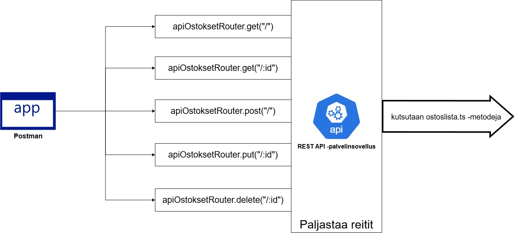
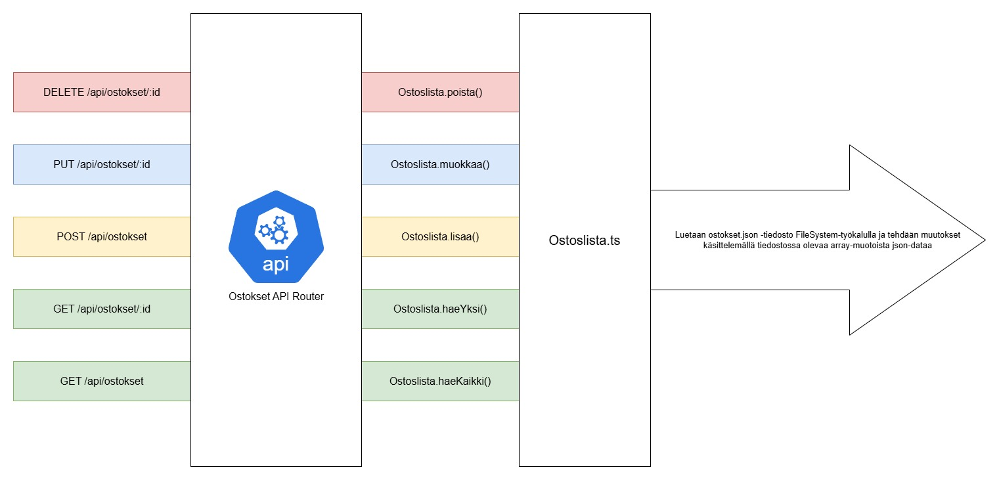

# Ostokset-tietokanta

### [<- Takaisin](../README.md)

Tässä demossa ostokset-tietokantaa esittää [json-tiedosto](../models/ostokset.json), johon kaikki ostokset on listattu. Kyseessä on siis json-olioista muodostettu array, eli järjestetty lista. Jokainen olio on [Ostoslista-luokan](../models/ostoslista.ts) Ostos-rajapinnan mukainen sisältäen id:n, tuote-tiedon ja poimittu-tiedon.

Demo toimii niin, että Ostokset API määrittää käsittelijät eri HTTP -metodeille (GET, POST, PUT, DELETE). Kun johonkin reiteistä tulee pyyntö, Ostokset API kutsuu Ostoslista-luokan metodeja. Ostoslista-luokka määrittää metodit, jotka suoraan käsittelevät tietokantaa esittävää json-tiedostoa ja sen sisältämää listaa ostoksista.

