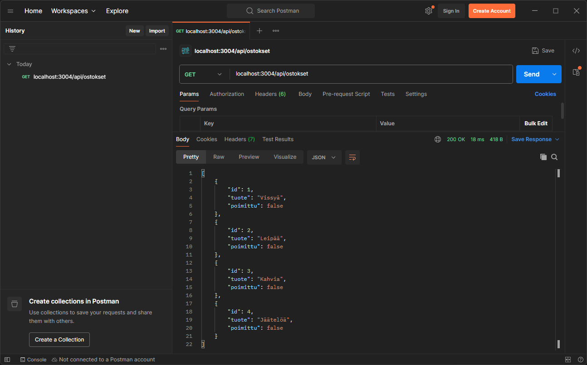
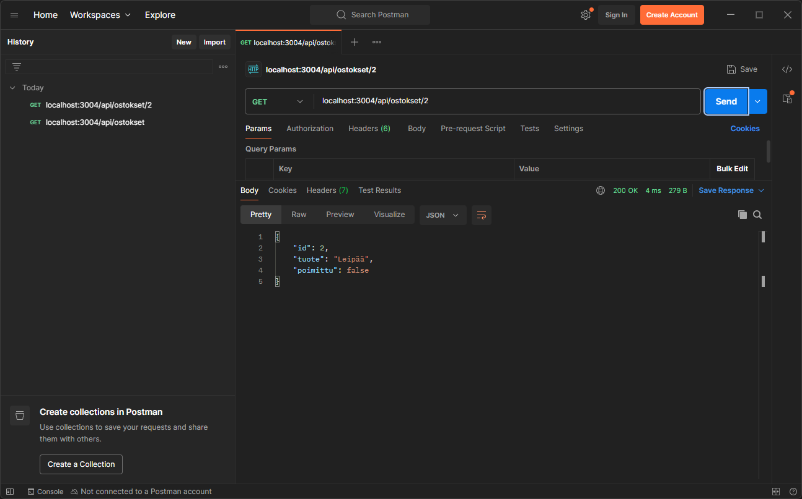
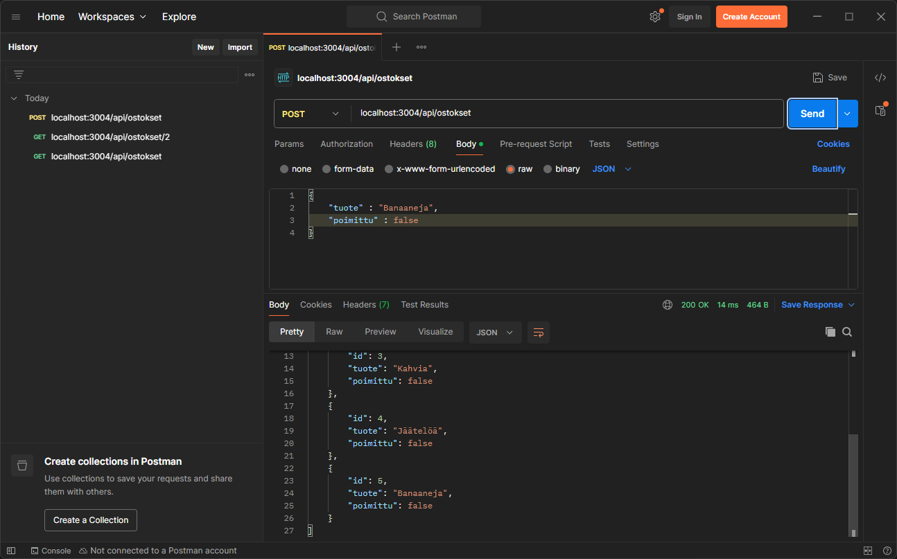
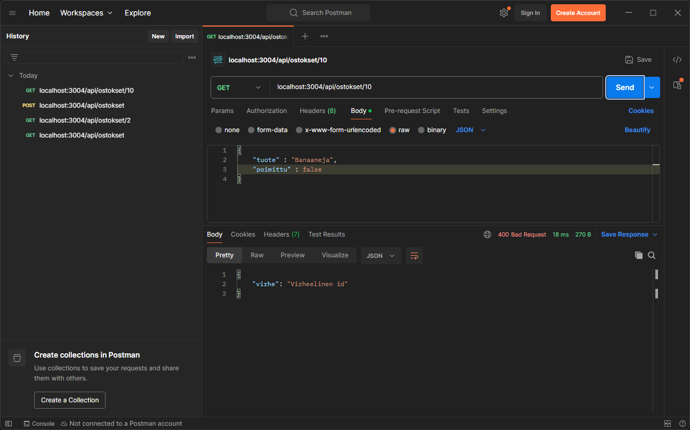
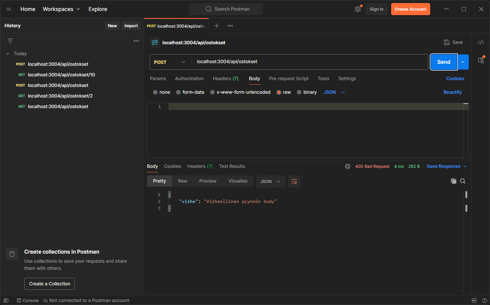
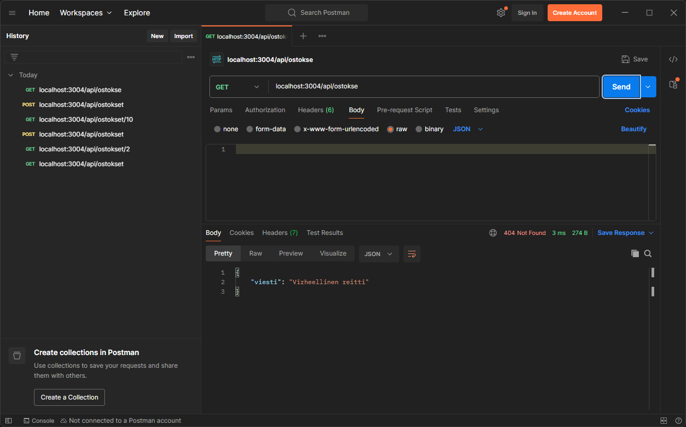

# Demo 4 - Virheiden käsittely REST API -sovelluksessa

Demossa 4 jatketaan Demo 3:ssa aloitetun ostoslista-sovelluksen kehittämistä lisäämällä siihen virheiden käsittelyä. Tähän mennessä sovellus toimii teknisesti, mutta se ei käsittele virhetilanteita riittävän hyvin. Mitä tapahtuu, jos käyttäjä yrittää hakea ostosta, jota ei ole olemassa? Entä jos pyynnön body on virheellinen? Tällä hetkellä sovellus voi kaatua tai palauttaa epäselviä virheilmoituksia.

Demossa käytettäviä tekniikoita ja käsitteitä:

- Keskitetty virheiden käsittely Express-middlewarella
- Oma virheolio statuskoodilla ja virheilmoituksella
- Pyynnön validointi reittikäsittelijöissä
- 404-käsittely virheellisille reiteille

## 1 Lähtötilanne

Tämä demo jatkaa suoraan siitä, mihin Demo 3 päättyi. Meillä on toimiva ostoslista-sovellus, jossa:
- Ostokset tallennetaan json-tiedostoon
- Ostoslista-tietomalli käsittelee tietokannan operaatioita
- REST API -rajapinta on eriytetty Express Routerilla `/api/ostokset`-polkuun
- Kaikki CRUD-operaatiot (Create, Read, Update, Delete) toimivat

Ongelmia nykyisessä toteutuksessa:
- Virheellinen id-parametri voi aiheuttaa odottamattoman käyttäytymisen
- Tyhjä tai virheellinen request body kaataa sovelluksen ilman selkeää virheilmoitusta
- Virheet eivät palauta selkeitä HTTP-statuskoodeja

## 2 Virheiden käsittelyn perusteet

Ennen kuin aloitamme ohjelmoinnin, on hyvä ymmärtää Expressin virheiden käsittelyn peruslogiikka.

### 2.1 Virheiden käsittelijä otetaan käyttöön middlewarena

Express-sovelluksessa **middleware** on funktio, joka käsittelee HTTP-pyyntöjä ennen kuin ne saavuttavat lopullisen reittikäsittelijän tai sen jälkeen. Middleware-funktiot voivat:
- Muokata pyyntö- ja vastausobjekteja
- Päättää pyynnön käsittelyn
- Kutsua seuraavaa middlewarea ketjussa
- Käsitellä virheitä

Aiemmissa demoissa käytetyt app.use() -komennot ovat olleet middlewarejen käyttöönottoja. Staattisten tiedostojen kansion käyttö express.static()-metodilla ja json-objektien käsittely pyynnöissä express.json()-metodilla ovat kummatkin middlewareja. Samaa periaatetta käytetään myös virheiden käsittelijän käyttöönotossa.

### 2.2 Virheiden käsittelyn ketju

Demo 4:ssä virheet kulkevat seuraavasti:
1. Reittikäsittelijässä tapahtuu virhe
2. Virhe välitetään `next()`-funktion kautta virhekäsittelijälle
4. Virhekäsittelijä muodostaa asianmukaisen vastauksen käyttäjälle

### 2.3 HTTP-statuskoodit

HTTP-statuskoodit kertovat pyyntöä seuranneen tapahtuman tilan. REST API:ssa on tärkeää palauttaa oikeita HTTP-statuskoodeja:
- **200 OK** - Onnistunut pyyntö
- **400 Bad Request** - Virheellinen syöte
- **404 Not Found** - Virheellinen reitti
- **500 Internal Server Error** - Palvelimen virhe

## 3 Virhekäsittelijän rakentaminen

Aloitetaan luomalla keskitetty virheiden käsittely. Luodaan palvelimen juureen uusi kansio `/errors` ja sen alle tiedosto `virhekasittelija.ts`.

### 3.1 Luodaan virhekäsittelijästä oma luokka

Expressin oletusvirheet (`class Error`) eivät tarjoa tarpeeksi joustavuutta. Luodaan oma `Virhe`-luokka, joka laajentaa JavaScriptin `Error`-luokkaa ja sisältää HTTP-statuskoodin sekä mukautetun virheviestin.

#### virhekasittelija.ts
```typescript
import express from 'express';

export class Virhe extends Error {
    status : number  // HTTP-statuskoodi
    viesti : string  // Virheen kuvaus
    
    constructor(status? : number, viesti? : string) {
        super(); // Kutsutaan Error-luokan muodostinta
        this.status = status || 500; // Jos statusta ei anneta, käytetään 500 (palvelinvirhe)
        this.viesti = viesti || "Palvelimella tapahtui odottamaton virhe"; // Oletusvirheilmoitus
    }
}
```

**Miksi oma virheolio?**
- Voimme määrittää statuskoodin ja viestin samassa objektissa
- Parametrit ovat valinnaisia (`?`), joten voimme luoda virheitä joustavasti

### 3.2 Virhekäsittelijä-middleware

Seuraavaksi luodaan varsinainen middleware-funktio, joka käsittelee kaikki sovelluksessa syntyneet virheet.

#### virhekasittelija.ts (jatkoa)
```typescript
// export class Virhe extends Error {...}

const virhekasittelija = (err : Virhe, req : express.Request, res : express.Response, next : express.NextFunction) => {
    // Palautetaan virhe json-muodossa sopivalla statuskoodilla
    res.status(err.status).json({ virhe : err.viesti });
    
    next(); // Kutsutaan next() middleware-ketjun jatkamiseksi
}

export default virhekasittelija;
```

**Huomioita:**
- Virhekäsittelijä-middleware sisältää neljä parametria
- Ensimmäinen parametri `err` on `Virhe`-objekti
- Funktio palauttaa json-vastauksen, jossa on virheilmoitus
- Statuskoodi ja viesti tulevat `Virhe`-objektista

## 4 Virhekäsittelijän käyttöönotto palvelimella

Nyt kun virhekäsittelijä on luotu, otetaan se käyttöön palvelimen juuressa `index.ts`.

### 4.1 Tuodaan virhekäsittelijä

```typescript
import express from 'express';
import path from 'path';
import apiOstoksetRouter from './routes/apiOstokset';
import virhekasittelija from './errors/virhekasittelija'; // Tuodaan virhekäsittelijä

const app : express.Application = express();
const portti : number = Number(process.env.PORT) || 3004; // Portti vaihdettu demon mukaisesti 3004:ään

app.use(express.static(path.resolve(__dirname, "public")));

app.use("/api/ostokset", apiOstoksetRouter);
```

### 4.2 Rekisteröidään middlewaret

Middlewarejen järjestyksellä on väliä. Ne suoritetaan siinä järjestyksessä, kun ne on määritelty.

```typescript
// import express...
// const app...
// app.use(express.static...) // Staattisten tiedostojen middleware
// app.use("/api/ostokset"...) // API-reittien middleware

app.use(virhekasittelija); // Virhekäsittelijä-middleware tulee reittien jälkeen

// 404-käsittelijä virheellisille reiteille
app.use((req : express.Request, res : express.Response, next : express.NextFunction) : void => {
    
    if (!res.headersSent) { // Tarkistetaan, ettei vastausta ole jo lähetetty
        res.status(404).json({ viesti : "Virheellinen reitti"});
    }
    
    next();
});

app.listen(portti, () : void => {
    console.log(`Palvelin käynnistyi osoitteeseen: http://localhost:${portti}`);    
});
```

**Middlewarejen järjestys:**
1. Staattiset tiedostot
2. API-reitit (`/api/ostokset`)
3. Virhekäsittelijä (käsittelee API-reiteissä syntyneet virheet)
4. 404-käsittelijä (käsittelee kaikki tunnistamattomat reitit)

## 5 Validoinnin ja virheiden käsittelyn lisääminen reitteihin

Nyt meillä on virheiden käsittely otettuna käyttöön palvelimella middlewarena. Seuraavaksi lisätään validointi ja virheenkäsittelyn kutsu jokaiseen apiOstokset-reittikäsittelijään. Validoinnilla tarkoitetaan sitä, että pyynnön rakenteen oikeellisuus tarkistetaan ja vastataan siihen asianmukaisella tavalla. Jos pyyntö on tehty odotetulla tavalla, ohjelma suoritetaan normaalisti. Jos pyynnön rakenteessa, reitin osoitteessa tai jossain muussa tapahtuu joku virhe, reagoidaan tilanteeseen asianmukaisella virheilmoituksella kutsumalla `Virhe`-luokkaa. Tehdään muutokset järjestyksessä yksinkertaisimmasta monimutkaisimpaan.

### 5.1 Tuodaan Virhe-luokka

Ensin tuodaan `Virhe`-luokka `apiOstokset.ts`-tiedostoon:

```typescript
import express from 'express';
import { Virhe } from '../errors/virhekasittelija'; // Tuodaan Virhe-luokka
import Ostoslista, { Ostos } from '../models/ostoslista';

const ostoslista : Ostoslista = new Ostoslista();
const apiOstoksetRouter : express.Router = express.Router();
apiOstoksetRouter.use(express.json());
```

### 5.2 GET / - Kaikkien ostosten hakeminen

Aloitetaan yksinkertaisimmasta reitistä. Tässä ei tarvita pyynnön validointia, mutta lisätään virheenkäsittely tietokantayhteyteen:

```typescript
apiOstoksetRouter.get("/", (req : express.Request, res : express.Response, next : express.NextFunction) => {
    
    try {
        res.json(ostoslista.haeKaikki());
    } catch (e : any) {
        next(new Virhe()); // Jos tapahtuu virhe, välitetään se virhekäsittelijälle
    }
    
});
```

**Muutokset:**
- Lisättiin `next`-parametri reittikäsittelijään (req ja res jälkeen)
- `try-catch` -rakenne käsittelee mahdolliset virheet
- Virhe välitetään `next()`-funktiolle, joka ohjaa sen virhekäsittelijä-middlewarelle
    - Virhekäsittelijä luo uuden `Virhe`-ilmentymän oletustiedoilla, joka vastaa virhettä statuskoodilla 500, palvelimen odottamaton virhe.
    - `Virhe`-luokan oletusvirhe määriteltiin `virhekasittelija.ts`-tiedostossa

### 5.3 GET /:id - Yhden ostoksen hakeminen

Tässä tarvitaan validointi pyynnön id:lle. Varmistetaan, että id:tä vastaava ostos todellakin löytyy tietokannasta.

```typescript
apiOstoksetRouter.get("/:id", (req : express.Request, res : express.Response, next : express.NextFunction) => {
    
    try {
        if (ostoslista.haeYksi(Number(req.params.id))) {
            // Jos ostos löytyy, palautetaan se
            res.json(ostoslista.haeYksi(Number(req.params.id)));
        } else {
            // Jos ostosta ei löydy, lähetetään 400-virhe
            next(new Virhe(400, "Virheellinen id"));
        }
    } catch (e: any) {
        next(new Virhe()); // Odottamattomat virheet → 500
    }
    
});
```

**Validointilogiikka:**
- Tarkistetaan, että `haeYksi()` palauttaa ostoksen (ei `undefined`)
- Jos id on virheellinen, seuraa `400 - Virheellinen pyyntö`
- Jos tapahtuu muu virhe, seuraa `500 - Palvelimen odottamaton virhe`

### 5.4 POST / - Uuden ostoksen lisääminen

Lisäyksessä validoidaan pyynnön bodyn sisältö. Validoinnissa tarkastetaan, onko tuotteen arvon pituus enemmän kuin nolla.

```typescript
apiOstoksetRouter.post("/", async (req : express.Request, res : express.Response, next : express.NextFunction) => {
    
    let uusiOstos : Ostos = {
        id : 0,
        tuote : req.body.tuote,
        poimittu : Boolean(req.body.poimittu) // Varmistetaan boolean-tyyppi
    }
    
    // Validointi: tuote-kentän pitää olla olemassa ja sisältää tekstiä
    if (req.body.tuote?.length > 0) {
        
        try {
            await ostoslista.lisaa(uusiOstos);
            res.json(ostoslista.haeKaikki());
        } catch (e : any) {
            next(new Virhe()); // 500 Palvelimella tapahtui odottamaton virhe
        }
        
    } else {
        next(new Virhe(400, "Virheellinen pyynnön body")); // Jos pyynnön tuote-arvossa on jokin virhe
    }
    
});
```

**Validointilogiikka:**
- `req.body.tuote?.length > 0` tarkistaa, että tuote-kenttä on olemassa ja ei ole tyhjä
- `?` estää virheen tarkistuksen aikana, jos `tuote` on `undefined`. Ilman kysymysmerkkiä kehitysympäristö varoittaisi, että tuotteen pituutta tarkastaessa voi tulla virhe, jos tuote-arvoa ei ole määritetty. Tämä ei siis liity varsinaiseen pyynnön validointiin itsessään vaan tällä estetään kehitysympäristön virheilmoitus.

### 5.5 PUT /:id - Ostoksen muokkaaminen

Muokkauksessa tarvitaan sekä id-validointi että bodyn validointi:

```typescript
apiOstoksetRouter.put("/:id", async (req : express.Request, res : express.Response, next : express.NextFunction) => {
    
    let muokattuOstos : Ostos = {
        id : req.body.id,
        tuote : req.body.tuote,
        poimittu : req.body.poimittu
    }
    
    // Tarkistetaan ensin, että id on kunnossa
    if (ostoslista.haeYksi(Number(req.params.id))) {
        
        // Sitten validoidaan bodyn sisältö
        if (req.body.tuote?.length > 0 && (req.body.poimittu === true || req.body.poimittu === false)) {
            
            try {
                await ostoslista.muokkaa(muokattuOstos, Number(req.params.id));
                res.json(ostoslista.haeKaikki());
            } catch (e : any) {
                next(new Virhe());
            }
            
        } else {
            next(new Virhe(400, "Virheellinen pyynnön body"));
        }
        
    } else {
        next(new Virhe(400, "Virheellinen id"));
    }
    
});
```

**Sisäkkäinen validointi:**
1. Ulompi `if`: Tarkistetaan, että ostos id:llä löytyy
2. Sisempi `if`: Validoidaan bodyn sisältö
   - `tuote` pitää sisältää tekstiä
   - `poimittu` pitää olla eksplisiittisesti `true` tai `false`

### 5.6 DELETE /:id - Ostoksen poistaminen

Poistossa tarkistetaan vain id:

```typescript
apiOstoksetRouter.delete("/:id", async (req : express.Request, res : express.Response, next : express.NextFunction) => {
    
    if (ostoslista.haeYksi(Number(req.params.id))) {
        try {
            await ostoslista.poista(Number(req.params.id));
            res.json(ostoslista.haeKaikki());
        } catch (e : any) {
            next(new Virhe());
        }
    } else {
        next(new Virhe(400, "Virheellinen id"));
    }
    
});
```

## 6 Virheiden käsittelyn testaaminen

Nyt sovelluksen virheenkäsittely on valmis. Testataan, että se toimii eri tilanteissa.

### 6.1 Onnistunut pyyntö

Ensin varmistetaan, että normaalit pyynnöt toimivat edelleen:

#### Kaikkien ostosten hakeminen palauttaa listan

#### Yhden ostoksen hakeminen toimii oikealla id:llä

#### Uuden ostoksen lisääminen onnistuu oikealla tiedolla


### 6.2 Virheellinen id

Kokeillaan hakea ostosta id:llä, jota ei ole olemassa. Sovellus palauttaa selkeän virheviestin ja statuskoodin 400:



### 6.3 Virheellinen request body

Kokeillaan lisätä ostos ilman tuote-kenttää tai tyhjällä tuote-kentällä. Validointi havaitsee puuttuvan tiedon ja palauttaa 400-virheen:



### 6.4 Virheellinen reitti

Kokeillaan kutsua reittiä, jota ei ole olemassa (esim. `/api/ostokse` tai `/api/ostokset/tuote`). 404-käsittelijä huolehtii tuntemattomista reiteistä:



## 7 Lopuksi

Tässä demossa toteutimme yksinkertaisen virheiden käsittelyn REST API -sovellukseen:

- Keskitetty virheiden käsittely, jossa kaikki virheet kulkevat yhden virhekäsittelijän kautta (middleware)
- Mukautettu `Virhe`-objekti mahdollistaa virheilmoitusten toteuttamisen tilanteesta riippuen joustavasti
- `apiOstokset`-rajapinnan reittikäsittelijät validoivat käyttäjän pyynnöt ennen tietokannan käsittelyä
- Sovellus palauttaa ymmärrettäviä virheilmoituksia

### 7.1 Virheiden käsittelyn parhaat käytännöt

**1. Validoi aina käyttäjän syötteet**
- Älä luota siihen, että käyttäjä lähettää oikeanlaista dataa
- Tarkista parametrit ja request body ennen käsittelyä

**2. Käytä asianmukaisia HTTP-statuskoodeja**
- 400 = Virheellinen pyyntö
- 404 = Virheellinen reitti
- 500 = Palvelinvirhe (odottamattomat virheet)

**3. Käytä try-catch -rakenteita**
- Tietokannan käsittely voi epäonnistua monesta syystä
- Odottamattomat virheet pitää käsitellä yleisellä virhekäsittelijällä (catch)

**4. Testaa virhetilanteet**
- Älä testaa vain onnistuvia pyyntöjä
- Varmista, että virhetilanteet käsitellään oikein

### 7.2 Ohjelmakoodin refaktoroinnista

Tässä demossa teimme muutoksen Demo 3:n koodiin. Tätä kutsutaan myös refaktorioinniksi. Lisäsimme:
- Uuden kansion (`/errors`) ja tiedoston (`virhekasittelija.ts`)
- `next`-parametrin jokaiseen reittikäsittelijään
- Validointilogiikkaa jokaiseen reittiin

Tämä on normaalia toimintaa ohjelmistokehityksessä. Sovellukset kasvavat ja kehittyvät. On tärkeää osata lisätä uusia ominaisuuksia (kuten virheiden käsittely) olemassa olevaan koodiin ilman, että rikotaan toimivaa logiikkaa.

## 8 Seuraavaksi

Ostoslista-sovellus on nyt teknisesti vankalla pohjalla. Seuraavassa demossa siirrymme käyttämään oikeita tietokantoja (SQLite) Prisma ORM:n avulla. Virheiden käsittelyn periaatteet pysyvät samoina, mutta tietokannan käsittelyn logiikka yksinkertaistuu merkittävästi, kun emme enää käsittele json-tiedostoja manuaalisesti omalla `ostoslista.ts`-tietomallilla.