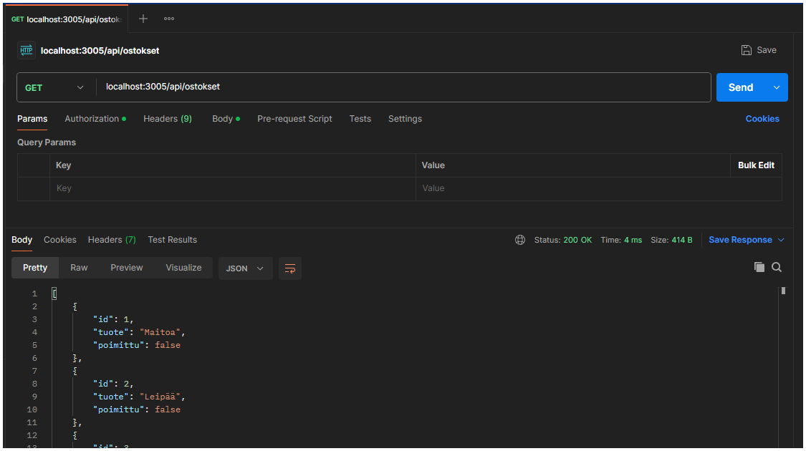
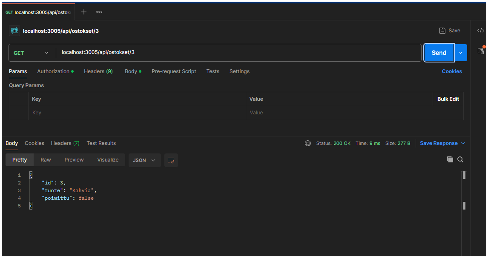
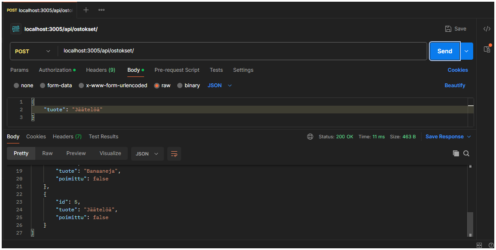
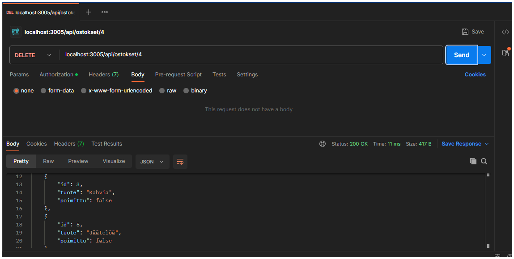
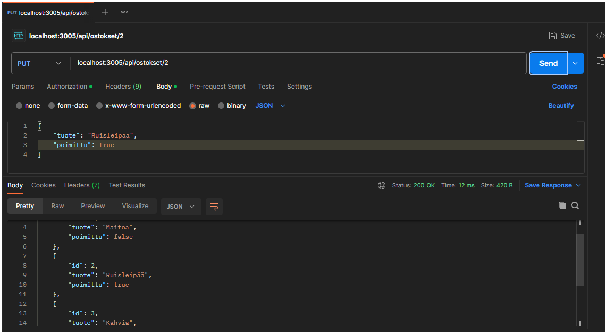

# Prisma ORM käyttö apiOstokset-routessa

### [<-- Takaisin](../README.md)

## 1. Tietokannan käyttöönotto

Kuten Prisman [käyttöönoton ohjeistuksessa](PRISMA-ORM-KAYTTO.md) kerrottiin, Prisma-tietokanta otetaan käyttöön asentamalla `@prisma/client`-apusovellus ja tuomalla se `apiOstokset`-routeen.

```tsx
import { PrismaClient } from '@prisma/client';

const prisma : PrismaClient = new PrismaClient();
```

Prisman komentoja voidaan nyt hyödyntää aiemman demon reiteissä muuttamalla näiden sisältämää koodia hieman. Aloitetaan kaikkien tietojen hakemisesta. Demossa reittejä voi testata Postman-sovelluksella.

## 2. Kaikkien ostosten hakeminen

Tietokannan kaikki ostokset haetaan prisman `findMany`-metodilla. Huomaa, että haku tehdään prisman alla olevaan tauluun (model) `ostos`, joka määritetään Prisman käyttöönoton yhteydessä skeemaan ([schema.prisma](../prisma/schema.prisma)). Huomio myös, että kaikki prisman komennot ovat asynkroonisia, jolloin REST API -reittien nuolifunktiotkin tulee määritellä asynkroonisiksi.

```tsx
apiOstoksetRouter.get("/", async (req : express.Request, res : express.Response, next : express.NextFunction) => {

    try {
        res.json(await prisma.ostos.findMany());
    } catch (e : any) {
        next(new Virhe());
    }

});
```



## 3. Yhden ostoksen hakeminen

Yhden ostoksen hakeminen tapahtui lisäämällä `/api/ostokset/`-reitin perään reittiparametrina id, jota vastaa jokin ostos tietokannan ostos-taulussa. Jokaista id:tä tulisi vastata vain yksi ostos, jolle tehdäänkin tarkistus ennen ostoksen hakemista.

- `prisma.ostos.count`: Laskee määrän ostoksille, joiden id-sarakkeen arvo on reittiparametrina annettu id (tulisi olla aina 1)
- `prisma.ostos.findUnique`: Hakee tietokannasta uniikin tietueen annetulla reittiparametrilla id.
- Jos id:llä ei löydy tuotetta, muodostetaan virhekäsittelijällä uusi virhe statuksella 400.
- Jos tapahtuu jokin muu virhe, muodostetaan uusi [oletusvirhe](../errors/virhekasittelija.ts) (status 500, odottamaton virhe)

```tsx
apiOstoksetRouter.get("/:id", async (req : express.Request, res : express.Response, next : express.NextFunction) => {

     try {

        if (await prisma.ostos.count({
            where : {
                id : Number(req.params.id)
            }
        }) === 1) {
            res.json(await prisma.ostos.findUnique({
                where : {
                    id : Number(req.params.id)
                }
            }))
        } else {
            next(new Virhe(400, "Virheelinen id"));
        }
        
    } catch (e: any) {
        next(new Virhe());
    }
    

});
```



## 4. Uuden ostoksen lisääminen ostoslistaan

Uuden ostoksen lisääminen tehdään `apiOstokset`-routen juureen POST-metodilla (pyynnön koko polku `http://loclahost:3005/api/ostokset/`). Pyynnön mukana lähetetään pyynnön body, johon pitää Postmanilla testatessa itse määrittää ainakin `tuote`-nimi. Myös `poimittu`-tiedon voi halutessaan lisätä, muuten Prisma asettaa sen oletuksella `false` (*@default(false)-määritys skeemassa*).

Tuotteen lisäämisen yhteydessä tarkastetaan ensiksi, onko pyynnön body:ssa tuote määritelty oikein. Jos bodyssa tuote-tiedon merkkijono on pidempi kuin nolla ja syntaksi on muutenkin oikein, voidaan ostos luoda tuotteen nimellä. Tiedot syötetään muuten JSON-datana ja tätä varten Postman-sovelluksessa pyynnön body pitää olla määritetty oikein (esim. raw-valinta + JSON-kieli vetovalikosta, ks. kuvat).

Jos tuote oli määritelty oikein, suoritetaan prisman ostos-tauluun `create`-komento, johon annetaan parametrina json-muodossa data-objekti, jolle on määritetty tiedot `tuote` ja `poimittu`, kuten tietokannan ostos-taulussakin on. Tuotteen nimi otetaan pyynnön bodysta, kuten myös poimittu-tieto, jos sellainen on annettu. Muuten prisma asettaa oletukseksi `false`. Tämän jälkeen tietokannan kaikki tietueet haetaan uudelleen.

```tsx
piOstoksetRouter.post("/", async (req : express.Request, res : express.Response, next : express.NextFunction) => {
 
      if (req.body.tuote?.length > 0) {

        try {

            await prisma.ostos.create({
                data : {
                    tuote : req.body.tuote,
                    poimittu : Boolean(req.body.poimittu)
                }
            });
    
            res.json(await prisma.ostos.findMany());
    
        } catch (e : any) {
            next(new Virhe())
        }

    } else {
        next(new Virhe(400, "Virheellinen pyynnön body"));
    } 

});
```



## 5. Ostoksen poistaminen ostoslistasta

Ostoksen poistaminen tehdään samalla tavalla id-reittiparametrin avulla kuin yksittäisen tuotteen hakeminen. Tässäkin tarkistetaan, että id:llä löytyy varmasti vain yksi tuote ennen poiston yritystä. Poistaminen tapahtuu prisman `delete`-komennolla, jonka parametriksi annetaan `where`-lisämääritys, jolla voidaan hakea tietuetta, jossa id on annettu arvo. Tämän jälkeen ostokset haetaan uudelleen tulostamiseksi.

```tsx
apiOstoksetRouter.delete("/:id", async (req : express.Request, res : express.Response, next : express.NextFunction) => {

     if (await prisma.ostos.count({
           where : {
                id : Number(req.params.id)
            }
        }) === 1)  {
        try {

            await prisma.ostos.delete({
                where : {
                    id : Number(req.params.id)
                }
            });

            res.json(await prisma.ostos.findMany());

        } catch (e : any) {
            next(new Virhe())
        }
    } else {
        next(new Virhe(400, "Virheellinen id"));
    }

});
```



## 6. Ostoksen muokkaaminen listassa

Ostoksen muokkaaminen on hyvin samanlainen prosessi kuin yksittäisen ostoksen hakeminen tai ostoksen poistaminen. Tässä tehdään lisätarkistuksena pyynnön bodyyn tarkistus siitä, että kun ostosta muokataan, niin tuotteen uusi nimi annetaan ja poimittu-arvo päivitetään samalla. Jos ehto on tosi, suoritetaan prismalla `update`-komento, jossa haetaan annetulla id:llä oleva ostos, josta päivitetään `tuote` ja `poimittu` -tiedot. Lopuksi tehdään vielä haku tulostusta varten kaikille ostoksille.

```tsx
apiOstoksetRouter.put("/:id", async (req : express.Request, res : express.Response, next : express.NextFunction) => {

    if (await prisma.ostos.count({
        where : {
            id : Number(req.params.id)
        }
        }) === 1) {
        if (req.body.tuote?.length > 0 && (req.body.poimittu === true || req.body.poimittu === false)) {

            try {

                await prisma.ostos.update({
                    where : {
                        id : Number(req.params.id)
                    },
                    data : {
                        tuote : req.body.tuote,
                        poimittu : req.body.poimittu
                    }
                });
        
                res.json(await prisma.ostos.findMany());
        
            } catch (e : any) {
                next(new Virhe())
            }

        } else {
            next(new Virhe(400, "Virheellinen pyynnön body"));
        }
    } else {
        next(new Virhe(400, "Virheellinen id"));
    }

});
```



## 7. Lopuksi

Tässä olikin demo 5 ja Prisma ORM:llä toteutetun SQLite-tietokannan käyttöönotto osanan ostoslista-sovellusta kokonaisuudessaan. Vaikka demossa onkin enemmän koodia, suurin osa muusta koodista on jo vanhaan demoon pohjautuvia. Ainoa muutos oli tietokannan vaihtuminen ostoslista.ts -modelista ja ostokset.json -tiedostosta varsinaiseen SQL-tietokantaan. Tämä vaati apiOstokset-routen reittien koodin päivittämisen, mutta muuten toiminnallisuus on täysin sama.

Seuraavaksi siirytään Sovellusohjelmointi 2 -aiheissa asiakassovelluksen ja palvelinsovelluksen yhdistämiseen ja ostoslistalle toteutetaan oikea graafinen käyttöliittymä. Taustalla oleva toiminnallisuus ei muutu merkittävästi: tietokantaa hallitaan edelleen apiOstokset-routen eri pyynnöillä, mutta Postmanilla tehtyjen kutsujen sijaan asiakassovelluksen käyttöliittymä lähettää ohjelmallisesti oikeanmuotoiset pyynnöt eri reiteille, jolloin sovelluksen ja taustalla olevan tietokannan käsittely on ihmisystävällisempää.

### [<-- Takaisin](../README.md)