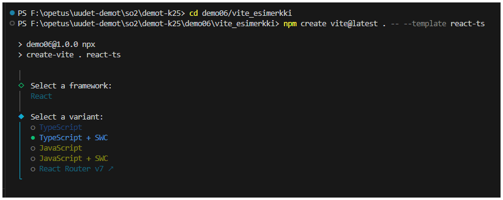
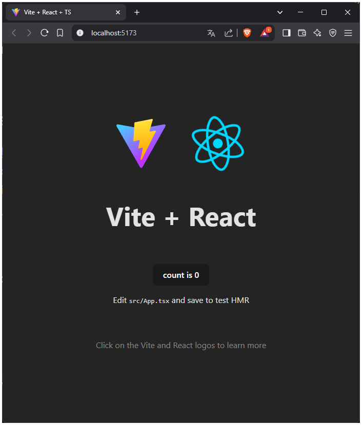
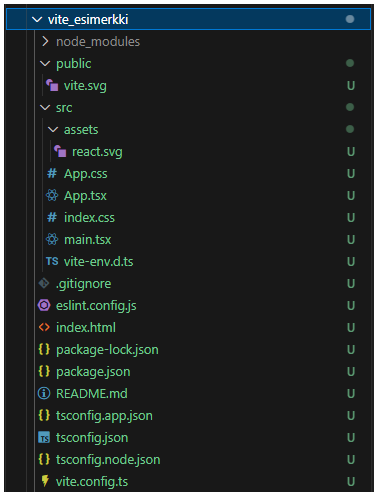
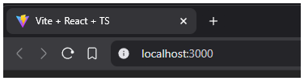
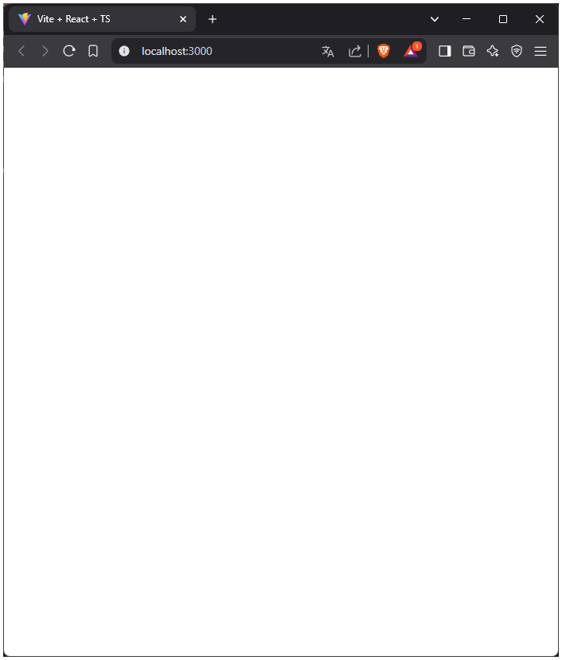

# Vite + React -projektin asennus ja käyttöönotto

### [<-- Takaisin](../README.md)

Seuraavaksi on lyhyt esittely Vite-projektista ja TypeScript-pohjaisen React-sovelluksen toteuttamisesta tällä. Tämän jälkeen käydään nopeasti demossa toteutetut muokkaukset oletusprojektiin, joilla saadaan ylimääräiset liikkuvat osat pois häiritsemästä. Koska Vite alustaa uuden React-projektin automaattisesti esimerkkisovelluksella kuten CRA, pitää jonkun verran siivoamista tehdä Ostoslista-sovelluksen pohjaa varten. Nämä työvaiheet käydään kuitenkin läpi kohta kohdalta.

## 1. Vite

[Vite](https://vite.dev/guide/ "https://vite.dev/guide/") on Vue:n kehittäjän [Evan You:n](https://github.com/yyx990803) projekti, jonka tavoitteena on tarjota nopea ja kevyempi kehitysympäristö modernien verkkosovellusten toteuttamiseen. Vite koostuu pääasiassa kehityspalvelimesta ja lopullisen sovelluksen build-työkalusta. Vite:n kehitysympäristö tarjoaa muun muassa tuen [JavaScript-moduulien](https://developer.mozilla.org/en-US/docs/Web/JavaScript/Guide/Modules) käytölle (tuonti import-komennolla).

## 2. Vite + React -projektin luominen tyhjään VS Code -projektiin.

Tähän asti olet aloittanut kaikki uudet Node-projektit VS Codella tyhjään kansioon, jonka olet toivottavati luonut aina johonkin selkeään hakemistoon koneellasi (esim. so2-demot -kansio). Nyt kun asiakassovellus yhdistetään palvelinsovellukseen, luodaan jo alustetun palvelinsovelluksen juureen uusi kansio [`client`](../client/), jonka alle asiakassovellus luodaan. Siirry VS Coden komentokehotteella kansion alle komennolla `cd`.

Kun olet oikeassa paikassa, voit luoda kansioon uuden Vite-projektin komennolla:

`npm create vite@latest . -- --template react-ts`



Komennolla asiakassovelluksen projekti luodaan nykyiseen sijaintiisi React-TypeScript -pohjalla. Asennusohjelma pyytää valitsemaan verkkosovelluksen kirjaston ja tämän variantin. Valitse aluksi `React` ja sitten `TypeScript + SWC`. Kun Vite-projekti on alustettu, asennusohjelma pyytää sinua vielä asentamaan Node-riippuvuuden komennolla `npm install`. Tämän jälkeen kehityspalvelimen voi käynnistää komennolla `npm run dev`.

Oletuksena sovellus näyttää tältä selaimessa:



## 3. Vite + React -projektin siivoaminen Ostoslista-sovellusta varten

Asennuksen jälkeen asiakassovelluksen projektikansion pitäisi näyttää tältä:



Rakenne on hyvin samanlainen CRA-sovelluksen kanssa, mutta muutamia eroavaisuuksiakin on. Esimerkiksi sovelluksen sisääntulopisteenä toimiva [`index.html`-tiedosto](../client/index.html) on suoraan projektin juuressa, eikä public-kansion alla. React-sovelluksen toiminnallisesta näkökulmasta katsottuna sovelluksen toiminta on kuitenkin aivan samanlainen CRA:lla toteutetun sovelluksen kanssa. [`src`-kansion](../client/src/) alla oleva [`main.tsx`-tiedosto](../client/src/main.tsx) toimii React-sovelluksen juurena, joka yhdistyy `index.html`-tiedostoon ja renderöi [`App.tsx`-komponentin](../client/src/App.tsx) sisällön tänne.


Poistetaan seuraavaksi tarpeettomat tiedostot ja kansiot projektista. Alla oleva lista sisältää poistettavat asiat ja selitykset, miksi näitä ei tarvita:

- `public/vite.svg`: Vektorigrafiikkakuva Vite + React -esimerkkisovelluksen App-komponentin näkymässä. Tätä ei käytetä ostoslistassa, joten sen voi poistaa. Public-kansio sisältää React-sovelluksen staattiset tiedostot, esim. kuvat. Tässä projektissa ei kuitenkaan ole staattisia tiedostoja, joten itseasiassa koko kansio on tarpeeton.
- `src/assets/react.svg`: Sama selitys kuin yllä. `src/assets`-kansion alle tuodaan sovelluksessa näytettävät tiedostot, joita tarvitsee hallita ohjelmallisesti, esim. animoidut kuvat. Sovelluksessa ei ole animoituja kuvia, joten koko kansion voi poistaa.
- `src/App.css`: App-komponentin tyylit, jotka Vite määrittelee. Ostoslista-sovelluksessa käytetään tyyleihin Material UI -kirjastoa, jolloin itse määritellyt tyylit ovat lähtökohtaisesti tarpeettomia. Tiedosto sisältää myös sovellukselle "haitallisia" muotoiluja, joten poistetaan tämä häiritsemästä.
- `src/index.css`: Sama selitys kuin yllä. Tämä tiedosto sisältää koko React-sovelluksen tasolla tietyt perustyylit, jotka vaikuttavat kaikkiin komponentteihin. Nyt tyylejä ei tarvita, joten poistetaan tiedosto.

Loput tiedosoista tulee säilyttää. Vite-kehitysympäristö sisältää paljon määrittelytiedostoja, jotka ovat projektin toiminnan ja kääntämisen kannalta oleellisia, joten näihin ei pidä puuttua. Käytännössä kaikki oleellinen ohjelmointi ja koodimuutokset tehdään `App.tsx`, `main.tsx`, `index.html` ja `vite.config.ts` -tiedostoihin.

Siivotaan seuraavaksi turhat koodit sovelluksesta täysin puhtaan pohjan saamiseksi. Määritetään samalla demoa varten Vite-kehitysympäristön portiksi 3000 oletuksen (5173) sijasta.

#### 3.1 Vite-kehitysympäristön määrittely (vite.config.ts)

Lisätään tiedostoon plugins-osan jälkeen pilkulla eroteltuna määritys server, johon lisätään tieto käytettävästä portista.

```ts
import { defineConfig } from 'vite'
import react from '@vitejs/plugin-react-swc'

// https://vite.dev/config/
export default defineConfig({
  plugins: [react()],
  server: {
    port: 3000
  }
})
```



#### 3.2 Sisääntulopisteen muokkaus

Muutetaan index.html -tiedoston sisältöä hieman. Alla muokattu koodi, josta on poistettu välilehden Vite-logo ja otsikko muutettu demoa vastaavaksi:

```html
<!doctype html>
<html lang="en">
  <head>
    <meta charset="UTF-8" />
    <meta name="viewport" content="width=device-width, initial-scale=1.0" />
    <title>Demo 6</title>
  </head>
  <body>
    <div id="root"></div>
    <script type="module" src="/src/main.tsx"></script>
  </body>
</html>
```

#### 3.3 React-sovelluksen juurikomponentin muokkaus

Muokataan React-sovelluksen juurena toimivan main-komponentin koodeja hieman. Alla olevassa koodissa on poistettu tarpeeton tyylitiedoston tuonti:

```tsx
import { StrictMode } from 'react'
import { createRoot } from 'react-dom/client'
import App from './App.tsx'

createRoot(document.getElementById('root')!).render(
  <StrictMode>
    <App />
  </StrictMode>,
)
```

Komponentti tekee viittauksen index.html-tiedoston root-elementtiin (div), johon sovellus renderöi annetut React-komponentit (App).

#### 3.4 App-komponentin alustus

Alustetaan App-komponentti siten, että tarpeettomat tyylit ja sisällöt on poistettu ja komponentin rakenne tukee TypeScriptin vahvaa tyypitystä:

```tsx
import React from 'react';

const App : React.FC = () : React.ReactElement => {

  return(
    <>
    </>
  );
}

export default App;
```

App-komponentti määritellään funktiona (Reactin funktiokomponentti), joka palauttaa (return) JSX-muotoisen ReactElementin. Komponentti on vaihdettu Vite:n oletusesityksestä nuolifunktioksi helpomman vahvan tyypityksen vuoksi. JSX-merkkauksessa palautuksessa tulee olla vain yksi parent-tason elementti `<>...</>`, jonka sisälle kaikki komponentin sisältö rakennetaan. Mahdolliset tuonnit, TypeScript interfacet jne. määritetään funktiokomponentin yläpuolella. Tilamuuttujat ja muut React-hookit ja metodit määritellään komponentin sisään ennen palautusta.

#### 3.5 Alustettu sovellus selaimessa

Nyt alustetun sovelluksen pitäisi näyttää selaimessa tältä:



Jatketaan sovelluksen rakentamista

### [<-- Takaisin](../README.md)
