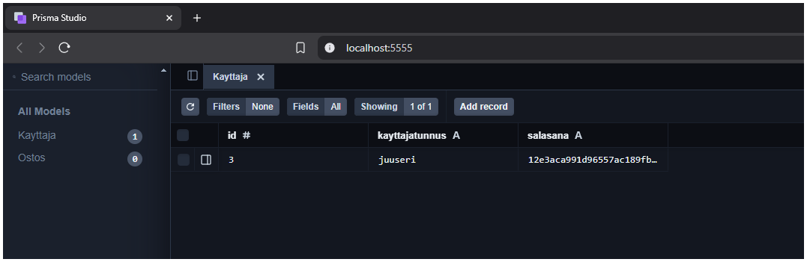

# Käyttäjän autentikointi

### [<-- Takaisin](../README.md)

Kuten tiivistelmässä sanottiin, asiakassovellukseen on lisätty uusi näkymä [käyttäjän kirjautumiselle](../client/src/components/Login.tsx). Nyt kun mietitään taas REST API -sovellusten rakentumista, niin käyttäjän kirjautumisellahan ei ole mitään tekemistä itse ostoslistan kanssa, vaikka käyttäjän autentikointi onkin osa ostoslistaan pääsyä. Tällaisessa tilanteessa on hyvin tyypillistä, että otetaan käyttöön useampi Express Route palvelinsovelluksessa.

Aiemmissa demoissa ainut toiminnallisuus liittyi ostoslistan hallintaan, jolloin oma rajapinta ja route ostoksille riitti. Nyt kuitenkin sovelluksen toiminnallisuus laajentuu, jolloin on otettava mukaan uusi route, joka liittyy käyttäjien hallintaan ja autentikointiin.

## 1. Käyttäjien autentikointi omassa reitissään

Palvelimelle on luotu routes-kansioon [`apiAuth.ts`](../routes/apiAuth.ts). Tämä on tyypillinen nimeäminen autentikoinnin rajapinnalle.

## 1.1 Prisma-tietokanta tallentaa ostosten lisäksi käyttäjät

Autentikoinnin rajapinnassa käytetään Prismaa käyttäjien tallentamiseen samalla tavalla kuin ostoslistassa. Prisman [skeemaan](../prisma/schema.prisma) on luotu Ostos-taulun lisäksi Käyttäjä-taulu:

```prisma
model Kayttaja {
  id             Int    @id @default(autoincrement())
  kayttajatunnus String
  salasana       String
}
```

Käyttäjälle on määritetty avain, tunnus ja salasana, joka tullaan tallentamaan salasanan hash-arvona. Salasanoja ei koskaan pidä tallentaa selkokielisinä, vaan salasanat aina suojataan enkryptaamalla, josta tallennetaan varsinaiseen tietokantaan salasanasta luotu hash. Tästä lisää toisaalla.

Huomioi, että tässä ei luoda kahta erillistä tietokantaa, vaan sama Prisma SQLite-tietokanta sisältää kaksi eri taulua eri tiedoille.

## 1.2 Käyttäjän kirjautumiselle luodaan oma reitti autentikoinnin rajapintaan

Prisma client tuodaan osaksi autentikoinnin rajapintaa...

```ts
import express from 'express';
import { PrismaClient } from '@prisma/client';
import { Virhe } from '../errors/virhekasittelija';
import jwt from 'jsonwebtoken';
import crypto from 'crypto';
```

...ja sitä käytetään kirjautumisen reitissä `/login` tarkistamaan käyttäjän syöttämät kirjautumistiedot:

```ts
apiAuthRouter.post("/login", async (req : express.Request, res : express.Response, next : express.NextFunction) : Promise<void> => {

    try {

        const kayttaja = await prisma.kayttaja.findFirst({
            where : {
                kayttajatunnus : req.body.kayttajatunnus
            }
        });

        if (req.body.kayttajatunnus === kayttaja?.kayttajatunnus) {
```

Kun käyttäjä kirjautuu, eli lähettää asiakassovellukselta pyynnön sisältäen kirjautumistiedot palvelimen `/login`-reittiin, prismaan tehdään tarkistus, löydetäänkö tietokannasta käyttäjää, jolla on annettu käyttäjätunnus. Myös salasana tarkastetaan.

Samalla tavalla kuin ostosten rajapinnassa, autentikoinnin rajapinnasta luodaan oma router, joka tuodaan osaksi palvelinta [(index.ts)](../index.ts).

##### apiAuth.ts määrittää routen
```ts
const apiAuthRouter : express.Router = express.Router();
```

##### index.ts tuo routen käyttöön ja määrittää reitin autentikoinnin eri pyynnöille
```ts
import apiAuthRouter from './routes/apiAuth';

app.use("/api/auth", apiAuthRouter);
```

Eli samalla tavalla kuin ostosten hallinnan kanssa, kirjoittamalla palvelimen juuren perään autentikoinnin rajapinnassa olevan polun, päästään tähän käsiksi. Koko polku on siis `http://localhost:3008/api/auth/login`. Tämän voi myös ajatella niin, että:

1. lähetetään palvelimelle (3008)...
2. ...pyyntö rajapintaan (/api)...
3. ...joka käsittelee autentikointia (/auth)...
4. ...ja täällä on reitti `/login`.

## 1.3 Käyttäjän salasanan luominen ja sen tarkistaminen kirjautmisessa (TÄRKEÄÄ)

Nyt käyttäjän kirjautumiselle on luotu oma rajapinta, jolla tämä toiminnallisuus on eroteltu muusta palvelinkoodista. Tämän lisäksi uusi route on tuotu käyttöön palvelimen juuressa.

Seuraavaksi katsotaan kirjautumisen logiikkaa palvelimella. Miten käyttäjän salasana tallennetaan hashiksi tietokantaan ja miten käyttäjän suojattua salasanaa voidaan verrata asiakassovelluksen kirjautumisessa kirjoitettuun selkokieliseen salasanaan.

### Aluksi hieman teoriaa:

Sovelluksessa käytetään Node:n crypto-aputyökalua salasanan kryptografiseen suojaamiseen. Se tarjoaa monipuolisen valikoiman algoritmeja ja työkaluja, joilla voidaan muun muassa luoda hash-arvoja, salata ja purkaa salauksia sekä luoda digitaalisia allekirjoituksia.

SHA256 (Secure Hash Algorithm 256-bit) on kryptografinen hash-funktio, joka muuntaa syötteen kiinteän kokoiseksi 256-bittiseksi (32 tavua) hash-arvoksi. Hash-arvo on yksisuuntainen, eli siitä ei voi palauttaa alkuperäistä syötettä. SHA256 on yleisesti käytetty salasanan tallentamisessa tietokantoihin, koska se tarjoaa hyvän suojan salasanojen paljastumista vastaan, vaikka tietokanta vuotaisi.

### Salasanan hash-arvon luominen erillisellä ohjelmalla

Demoamista varten salasanan hash luodaan omassa ohjelmassaan [`luoSalasana.js`](../luoSalasana.js) vähän kuin edellisessä demossa JWT-token.

Ohjelman suorittamalla salasanan hash tulostetaan komentokehotteeseen, josta sen voi poimia ja asettaa uuden käyttäjän salasanaksi Prisma-tietokannan Kayttaja-taulussa esim. Prisma Studiota käyttäen. 

```js
let hash = require("crypto").createHash("SHA256").update("passu123").digest("hex");

console.log(hash);
```

Salasanan hash-arvon luominen SHA256-algoritmilla sisältää seuraavat vaiheet:

- `require("crypto")`: Tuodaan crypto osaksi ohjelmaa.
- `createHash("SHA256")`: Luodaan hash-objekti, joka käyttää SHA256-algoritmia
- `update("passu123")`: Annetaan varsinainen syöte, eli muunnettava salasana hash-objektiin
- `digest("hex")`: Tallennetaan hash-arvo heksadesimaalimuodossa

Prisma studio käynnistetään omassa komentokehotteessaan komennolla `npx prisma studio`. Tietokanta sisältää kaksi taulua. Mennään tauluun Kayttaja ja luodaan uusi tietue (Add record). Tähän voidaan nyt kirjoittaa käyttäjätunnus ja poimia luoSalasana.js-ohjelman luoma salasanan hash-arvo tietokannan salasana-kenttään. Salasanoja ei tallenneta tietokantaan selkokielisenä. Nyt kun kirjaudutaan alkuperäisellä salasanalla, pitää jotenkin pystyä vertaamaan sitä hash-arvoon. Tästä seuraavaksi lisää.



### Salasanan vertaaminen hash-arvoon kirjautumisessa

Salasanaa ei voida palauttaa hash-arvosta takaisin selkokieliseksi. Miten sitten salasanan tarkistus voidaan toteuttaa? Kun käyttäjä lähettää kirjautumispyynnön asiakassovelluksesta autentikoinnin reittiin `/login`, palvelin luo kirjautumisikkunassa selkokielisenä kirjoitetusta salasanasta uuden hash-arvon, jota vertaa tietokannassa löytyviin hash-arvoihin.

```ts
if (req.body.kayttajatunnus === kayttaja?.kayttajatunnus) {

    let hash = crypto.createHash("SHA256").update(req.body.salasana).digest("hex");

    if (hash === kayttaja?.salasana) {

        let token = jwt.sign({}, "ToinenSalausLause_25");

        res.json({ token : token })

    } else {
        next(new Virhe(401, "Virheellinen käyttäjätunnus tai salasana"));
    }
```

Nyt on pidettävä huoli, että ei sekoita crypton salasanan enkryptausta ja jwt:n allekirjoitus-tokenin muodostamista. Kummassakin käytetään demossa selkokielisenä kovakoodattua salausta (joka ei ole sitten oikea toimintamalli tuotantosovelluksissa!).

Tällä menetelmällä vältetään nyt vain ylimääräisiä liikkuvia osia, jotta uuden asian määrä pidetään mahdollisimman vähäisenä demojen välillä.

JWT:llä siis luodaan autorisoinnin avain, joka lähetetään kirjautuneelle käyttäjälle ja tämän avulla palvelin tietää, että käyttäjän laitteelta lähetetyt pyynnöt liittyvät yhden ja saman käyttäjän sessioon. Autentikoinnissa luotiin salasana ja sen hash-arvo crypto-moduulilla, ja hash-arvo tallennetaan käyttäjätunnuksien tietokantatauluun. Kirjautuminen tapahtuu edelleen selkokielisellä salasanalla, jota verrataan enkryptattuun arvoon.

### [<-- Takaisin](../README.md)
